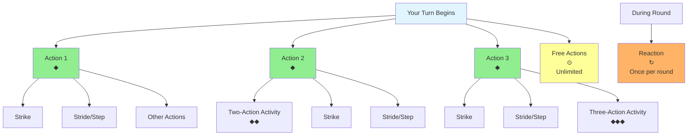
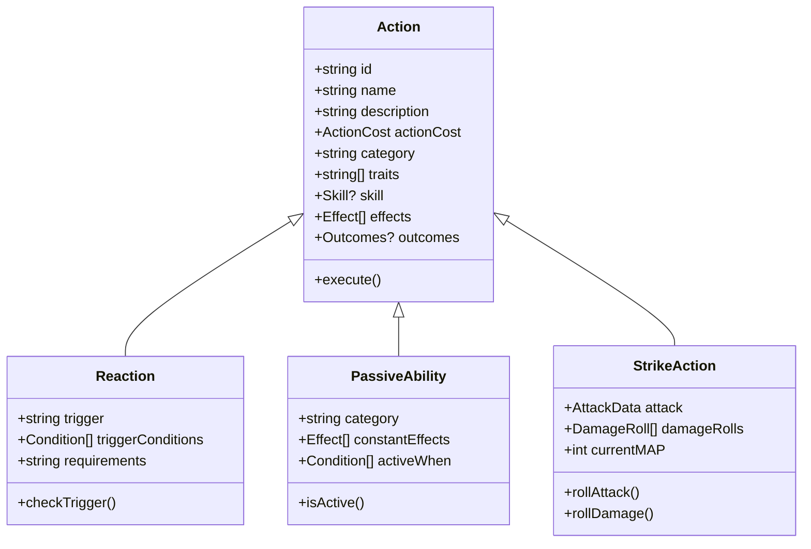

# Actions and Abilities

## Overview

Pathfinder 2e uses a three-action economy where most creatures get 3 actions per turn, plus 1 reaction per round. This document details how actions, activities, reactions, and special abilities are represented and function in combat.

## Action Economy



### Actions Per Turn
- **3 Actions**: Standard action allowance per turn
- **1 Reaction**: Can be used once per round (resets at start of your turn)
- **Free Actions**: Unlimited, but subject to GM discretion
- **Variable Actions**: Some creatures may have different action counts

### Action Symbols
- ◆ (Single Action): Costs 1 action
- ◆◆ (Two Actions): Costs 2 actions, called an "activity"
- ◆◆◆ (Three Actions): Costs 3 actions
- ↻ (Reaction): Uses your reaction
- ⊙ (Free Action): Costs 0 actions

## Action Categories

### Basic Actions
Actions available to all creatures without special training:

#### Movement Actions
- **Stride** ◆: Move up to your Speed
- **Step** ◆: Move 5 feet without triggering reactions
- **Leap** ◆: Jump horizontally or vertically
- **Crawl** ◆: Move 5 feet while prone
- **Stand** ◆: Stand up from prone
- **Drop Prone** ⊙: Fall prone

#### Combat Actions
- **Strike** ◆: Make a melee or ranged attack
- **Raise a Shield** ◆: Gain +2 AC circumstance bonus until start of next turn
- **Take Cover** ◆: Gain cover benefits
- **Aid** ↻: Help an ally with a check or attack
- **Ready** ◆◆: Prepare to use an action when a trigger occurs

#### Manipulation Actions
- **Interact** ◆: Use an object, open a door, pick up an item, etc.
- **Release** ⊙: Let go of something you're holding
- **Grab an Edge** ↻: Catch yourself when falling

#### Mental Actions
- **Recall Knowledge** ◆: Attempt to remember information
- **Seek** ◆: Look for something
- **Sense Motive** ◆: Determine if someone is lying

### Skill Actions
Actions tied to specific skills:

#### Acrobatics
- **Balance** ◆: Move across narrow or unsteady surfaces
- **Maneuver in Flight** ◆: Attempt a difficult flying maneuver
- **Squeeze** ◆: Move through a space smaller than you
- **Tumble Through** ◆: Move through an enemy's space

#### Athletics
- **Climb** ◆: Move across vertical or difficult surfaces
- **Force Open** ◆: Break open a door or container
- **Grapple** ◆: Grab an opponent
- **Shove** ◆: Push an opponent
- **Swim** ◆: Move through water
- **Trip** ◆: Knock an opponent prone
- **Disarm** ◆: Remove an opponent's weapon
- **High Jump / Long Jump** ◆◆: Jump farther than normal

#### Deception
- **Create a Diversion** ◆: Distract a creature
- **Feint** ◆: Fake out an opponent
- **Lie** ◆: Tell a falsehood
- **Impersonate** ◆+: Pretend to be someone else

#### Intimidation
- **Coerce** ◆+: Threaten someone over time
- **Demoralize** ◆: Frighten an opponent

#### Medicine
- **Administer First Aid** ◆◆: Stabilize or treat a condition
- **Treat Disease** ◆: Tend to a disease
- **Treat Poison** ◆: Treat a poison
- **Treat Wounds** ◆: Heal wounds over 10 minutes

### Class-Specific Actions
Actions granted by specific classes, feats, or features.

**Examples:**
- **Rage** (Barbarian) ⊙: Enter a rage
- **Hunt Prey** (Ranger) ◆: Designate prey
- **Raise Symbol** (Champion) ◆: Raise your holy symbol
- **Sneak Attack** (Rogue): Deal extra damage to flat-footed targets

## Data Structure



### Base Action Object
```
Action {
  // Identity
  id: string,
  name: string,
  description: string,
  
  // Action Cost
  actionCost: {
    actions: 0 | 1 | 2 | 3,      // Number of actions
    type: "action" | "reaction" | "free",
    trigger: string | null,       // For reactions
    requirements: string | null,  // Prerequisites
    frequency: string | null      // Usage limitations
  },
  
  // Categorization
  category: "offensive" | "defensive" | "movement" | "skill" | "interaction" | "passive",
  traits: string[],               // Action traits
  
  // Skill Requirement (if applicable)
  skill: {
    name: string,
    minimumProficiency: ProficiencyLevel | null,
    DC: integer | "varies"
  } | null,
  
  // Effects
  effects: Effect[],
  
  // Success Outcomes
  outcomes: {
    criticalSuccess: string,
    success: string,
    failure: string,
    criticalFailure: string
  } | null,
  
  // Limitations
  usableWhen: Condition[],        // When can this action be used
  cooldown: integer | null,       // Turns before reuse
  
  // Source
  source: {
    type: "basic" | "skill" | "feat" | "class" | "ancestry" | "item" | "spell",
    reference: string
  }
}
```

### Passive Ability
```
PassiveAbility {
  id: string,
  name: string,
  description: string,
  
  // Type
  category: "defensive" | "offensive" | "utility" | "sensory",
  traits: string[],
  
  // Effects
  effects: Effect[],
  constantEffects: ModifierEffect[],
  
  // Conditions
  activeWhen: Condition[] | null,  // When is this ability active
  
  // Source
  source: {
    type: "ancestry" | "class" | "feat" | "item" | "condition",
    reference: string
  }
}
```

### Reaction
```
Reaction {
  id: string,
  name: string,
  description: string,
  
  // Trigger
  trigger: string,                 // What causes this reaction
  triggerConditions: Condition[],  // Programmatic trigger conditions
  
  // Requirements
  requirements: string | null,
  
  // Effects
  effects: Effect[],
  
  // Outcomes
  outcomes: {
    success: string,
    failure: string | null
  },
  
  // Usage
  frequency: string | null,        // "once per round", "once per day", etc.
  
  // Source
  source: {
    type: "basic" | "feat" | "class" | "ancestry" | "item",
    reference: string
  }
}
```

## Common Actions Detail

### Strike Action
The most common combat action - making an attack.

```
StrikeAction {
  // Inherits from Action
  actionCost: { actions: 1, type: "action" },
  
  // Strike Specific
  attack: {
    type: "melee" | "ranged",
    weapon: WeaponReference,
    
    // Attack Roll
    attackModifier: integer,
    traits: string[],
    
    // Target
    reach: integer,
    range: { increment: integer, max: integer } | null,
    
    // Damage
    damageRolls: DamageRoll[],
    
    // Multiple Attack Penalty
    currentMAP: integer,          // -0, -5, or -10 (-4/-8 for agile)
    
    // Special Effects
    onHit: Effect[],
    onCrit: Effect[],
    attackEffects: string[]       // Like "grab", "knockdown", etc.
  }
}
```

### Cast a Spell
Casting spells follows specific rules:

```
CastSpellAction {
  actionCost: {
    actions: 1 | 2 | 3,           // Varies by spell
    type: "action"
  },
  
  spell: {
    name: string,
    level: integer,
    tradition: "arcane" | "divine" | "occult" | "primal",
    
    // Casting
    components: ("somatic" | "verbal" | "material" | "focus")[],
    requirements: string | null,
    
    // Targeting
    range: integer | "touch" | "unlimited",
    area: AreaEffect | null,
    targets: string,
    
    // Duration
    duration: string,
    sustained: boolean,
    
    // Save
    savingThrow: {
      type: "fortitude" | "reflex" | "will",
      DC: integer,
      basic: boolean
    } | null,
    
    // Effects
    effects: Effect[],
    
    // Heightening
    heightened: {
      level: integer,
      changes: string
    }[]
  }
}
```

## Special Ability Types

### Attack Abilities
Special attacks beyond basic strikes:

```
AttackAbility {
  name: string,
  actionCost: ActionCost,
  
  // Attack Properties
  attackType: "melee" | "ranged" | "spell",
  targets: string,
  range: integer | string,
  area: AreaEffect | null,
  
  // Hit and Damage
  attackRoll: boolean,            // Does it require an attack roll?
  savingThrow: SavingThrow | null,
  damage: DamageRoll[],
  
  // Special Effects
  effects: Effect[],
  limitedUses: {
    current: integer,
    max: integer,
    rechargeCondition: string
  } | null
}
```

### Aura Abilities
Ongoing area effects:

```
AuraAbility {
  name: string,
  type: "emanation" | "aura",
  
  // Area
  radius: integer,                // In feet
  centered: "self" | "point",
  
  // Effects
  effects: Effect[],
  
  // Activation
  alwaysActive: boolean,
  activationCost: ActionCost | null,
  deactivationCost: ActionCost | null,
  
  // Targeting
  affectsAllies: boolean,
  affectsEnemies: boolean,
  affectsSelf: boolean,
  excludedCreatures: string[]
}
```

### Triggered Abilities
Abilities that activate automatically under conditions:

```
TriggeredAbility {
  name: string,
  description: string,
  
  // Trigger
  trigger: {
    condition: string,
    frequency: "once per round" | "once per day" | "unlimited" | string
  },
  
  // Effects
  effects: Effect[],
  
  // Can be suppressed?
  optional: boolean
}
```

## Effect System

Effects are the core of how actions modify the game state.

### Effect Types

```
Effect {
  id: string,
  type: EffectType,
  
  // Targeting
  targets: TargetSpecification,
  
  // Duration
  duration: Duration,
  
  // Application
  applicationData: any,           // Type-specific data
  
  // Conditions
  conditions: Condition[]         // When effect applies
}

enum EffectType {
  Damage,
  Heal,
  ModifyStat,
  ApplyCondition,
  Move,
  CreateObject,
  Summon,
  Teleport,
  Transform,
  Grant Action,
  Remove Condition,
  Trigger Reaction,
  Custom
}
```

### Damage Effect
```
DamageEffect {
  type: EffectType.Damage,
  
  damage: {
    formula: string,              // "2d6+4", "1d8", etc.
    type: DamageType,
    additionalTypes: DamageType[],
    
    // Damage Modifiers
    persistent: boolean,
    splash: boolean,
    splashRadius: integer | null,
    
    // Conditional
    applyOn: "hit" | "crit" | "always",
    vsWeaknessOnly: boolean
  }
}
```

### Condition Effect
```
ConditionEffect {
  type: EffectType.ApplyCondition,
  
  condition: {
    name: string,                 // "frightened", "stunned", etc.
    value: integer | null,        // Condition value (if applicable)
    duration: Duration,
    
    // Save to Remove
    saveToRemove: {
      save: "fortitude" | "reflex" | "will",
      DC: integer,
      frequency: "end of turn" | "start of turn" | string
    } | null
  }
}
```

### Stat Modifier Effect
```
StatModifierEffect {
  type: EffectType.ModifyStat,
  
  modification: {
    stat: string,                 // "ac", "speed", "str", "perception", etc.
    modifierType: "status" | "circumstance" | "item" | "untyped",
    value: integer,
    operation: "add" | "multiply" | "set",
    
    // Conditional
    applyWhen: Condition[]
  }
}
```

## Action Traits

Traits modify how actions work and interact with other rules.

### Common Action Traits

| Trait | Effect |
|-------|--------|
| **Attack** | Affected by Multiple Attack Penalty |
| **Concentrate** | Can't be used while unable to act |
| **Flourish** | Can only use one flourish per turn |
| **Manipulate** | Triggers reactions like Attack of Opportunity |
| **Move** | Changes your position |
| **Press** | Requires a previous attack this turn |
| **Open** | Can't be used if you've already used a move action |
| **Secret** | GM rolls for you |
| **Auditory** | Requires ability to hear |
| **Visual** | Requires ability to see |
| **Mental** | Affects minds |
| **Death** | Can kill outright |
| **Incapacitation** | Reduced effects against higher-level creatures |
| **Stance** | Enters a combat stance, can only have one at a time |

## Duration System

```
Duration {
  type: "instant" | "sustained" | "rounds" | "minutes" | "hours" | "days" | "unlimited" | "until trigger" | "concentration",
  
  // For timed durations
  value: integer | null,
  unit: "round" | "minute" | "hour" | "day" | null,
  
  // For conditional durations
  endCondition: string | null,    // "until end of encounter", "until you rage again", etc.
  
  // Sustaining
  sustainAction: ActionCost | null,
  maxSustains: integer | null,
  
  // Timing
  startTiming: "immediately" | "start of next turn" | "end of turn",
  endTiming: "start of turn" | "end of turn" | "immediately"
}
```

## Complete Abilities Collection

```
CreatureAbilities {
  // Basic Actions (usually inherited)
  basicActions: Action[],
  
  // Strikes
  strikes: StrikeAction[],
  
  // Special Actions
  actions: Action[],
  
  // Reactions
  reactions: Reaction[],
  
  // Free Actions
  freeActions: Action[],
  
  // Passive Abilities
  passiveAbilities: PassiveAbility[],
  
  // Auras
  auras: AuraAbility[],
  
  // Triggered Abilities
  triggeredAbilities: TriggeredAbility[],
  
  // Active Effects (temporary)
  activeEffects: {
    effect: Effect,
    source: string,
    turnsRemaining: integer | null,
    sustainedBy: string | null
  }[],
  
  // Action State
  actionState: {
    actionsRemaining: integer,
    reactionUsed: boolean,
    flourishUsed: boolean,
    currentMAP: integer,
    stance: string | null
  }
}
```

## Usage Examples

### Example 1: Basic Fighter Turn
```
Turn Start:
- Actions: 3
- Reaction: Available
- MAP: 0

Action 1: Stride (move 25 feet)
- Actions Remaining: 2
- MAP: Still 0

Action 2: Strike with Longsword
- Roll: 1d20 + 10 (attack modifier)
- On Hit: 1d8+4 slashing damage
- Actions Remaining: 1
- MAP: Now -5

Action 3: Strike with Longsword (Second Attack)
- Roll: 1d20 + 5 (attack modifier - 5 MAP)
- On Hit: 1d8+4 slashing damage
- Actions Remaining: 0
- MAP: Now -10

Turn End:
- MAP resets to 0 at start of next turn
```

### Example 2: Wizard Turn with Spell
```
Turn Start:
- Actions: 3
- Reaction: Available

Action 1-2: Cast Fireball (2-action spell)
- Select 20-foot radius area within 500 feet
- All creatures in area make Reflex save vs DC 25
- Damage: 6d6 fire damage (half on success)
- Actions Remaining: 1

Action 3: Stride (move away from enemies)
- Move 25 feet
- Actions Remaining: 0
```

### Example 3: Using Reaction
```
Enemy Turn:
- Enemy moves adjacent to you
- Triggers your Attack of Opportunity reaction
- You make a Strike: 1d20+12 vs AC
- On Hit: Deal normal weapon damage
- Your Reaction: Now Used (until start of your next turn)
```

### Example 4: Passive Ability
```
Passive: Darkvision
- Always active
- Can see in darkness up to 60 feet
- No action cost
- No activation required
```

## Related Documents

- [Combat Statistics](combat-statistics.md) - Statistics used by actions
- [Skills and Proficiencies](skills-and-proficiencies.md) - Skill actions and training
- [Spells and Magic](spells-and-magic.md) - Spellcasting actions
- [Conditions and Effects](conditions-and-effects.md) - Status effects from actions
- [Equipment and Items](equipment-and-items.md) - Item-granted actions
