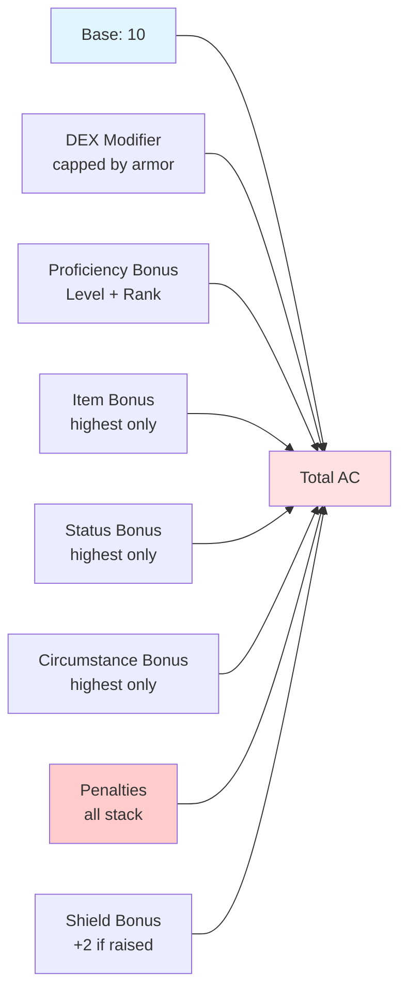
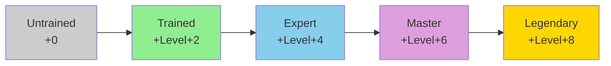

# Combat Statistics

## Overview

This document details the combat-related statistics that define a creature's defensive and offensive capabilities in Pathfinder 2e combat.

## Defensive Statistics

### Armor Class (AC)

Armor Class represents how difficult a creature is to hit with attacks.

#### AC Calculation



```
AC = 10 + DEX Modifier + Proficiency + Item Bonus + Other Bonuses/Penalties
```

**Components:**
- **Base**: Always 10
- **DEX Modifier**: Limited by armor's DEX cap
- **Proficiency**: Based on training level with worn armor
- **Item Bonus**: From armor and magical runes
- **Status Bonuses**: From spells and effects (don't stack)
- **Circumstance Bonuses**: From positioning, cover, etc. (don't stack)
- **Penalties**: Various sources (all apply)

#### Armor Proficiency Levels
- **Untrained**: +0
- **Trained**: +Level + 2
- **Expert**: +Level + 4
- **Master**: +Level + 6
- **Legendary**: +Level + 8

#### Armor Types and DEX Caps
| Armor Type | AC Bonus | DEX Cap | Check Penalty | Speed Penalty |
|------------|----------|---------|---------------|---------------|
| Unarmored  | +0       | Full    | 0             | 0             |
| Light      | +1-3     | +5      | 0 to -1       | 0             |
| Medium     | +3-5     | +3      | -2 to -3      | 0 to -5 ft    |
| Heavy      | +4-6     | +1      | -3 to -4      | -5 to -10 ft  |

#### Shield Mechanics
- **Shield Bonus**: +2 circumstance bonus when raised (1 action)
- **Shield Block**: Reaction to reduce damage
- **Shield Hardness**: Damage shield can absorb
- **Shield HP**: Can break if taking too much damage

**Data Structure:**
```
ArmorClass {
  base: 10,                    // Always 10
  dexModifier: integer,        // DEX mod, capped by armor
  dexCap: integer | null,      // Maximum DEX bonus from armor
  proficiencyBonus: integer,   // Level + proficiency rank
  proficiency: ProficiencyLevel, // Training level
  itemBonus: integer,          // From armor/runes
  statusBonus: integer,        // Highest status bonus
  circumstanceBonus: integer,  // Highest circumstance bonus
  penalties: integer,          // Sum of all penalties
  shieldBonus: integer,        // +2 if shield raised
  total: integer,              // Calculated total AC
  
  // Armor Details
  armorWorn: {
    name: string,
    category: "unarmored" | "light" | "medium" | "heavy",
    acBonus: integer,
    dexCap: integer | null,
    checkPenalty: integer,
    speedPenalty: integer,
    strengthRequirement: integer,
    traits: string[]
  } | null,
  
  // Shield Details
  shield: {
    raised: boolean,
    acBonus: 2,
    hardness: integer,
    hp: { current: integer, max: integer },
    brokenThreshold: integer
  } | null
}
```

### Hit Points (HP)

Hit Points represent how much damage a creature can take before being defeated.

#### HP Calculation (PCs)
```
Max HP = Ancestry HP
         + (Class HP + CON Modifier) × Level
         + Other Bonuses (feats, items, etc.)
```

#### HP by Ancestry
- **High**: 10 HP (Dwarf, Orc)
- **Medium**: 8 HP (Human, Elf, Half-Elf, Half-Orc)
- **Low**: 6 HP (Gnome, Goblin, Halfling)

#### HP by Class
| Class | HP per Level |
|-------|--------------|
| Barbarian | 12 |
| Fighter, Monk, Ranger | 10 |
| Champion, Rogue | 10 |
| Alchemist, Investigator, Swashbuckler | 8 |
| Bard, Cleric, Druid, Summoner | 8 |
| Sorcerer, Wizard | 6 |

#### Monster HP
- Calculated based on creature level and role
- No need to track ancestry/class breakdown
- May have fast healing or regeneration

**Data Structure:**
```
HitPoints {
  // Core Values
  max: integer,                // Maximum HP
  current: integer,            // Current HP
  temporary: integer,          // Temporary HP (from spells, etc.)
  
  // Sources (for PCs)
  ancestryHP: integer,
  classHP: integer,
  conModifier: integer,
  level: integer,
  bonusHP: integer,            // From feats, items, etc.
  
  // Damage Tracking
  damageHistory: {
    amount: integer,
    type: string,
    source: string,
    timestamp: number
  }[],
  
  // Special Healing
  fastHealing: integer | null, // HP healed per round
  regeneration: {
    amount: integer,
    weakness: string[]         // What stops regeneration
  } | null,
  
  // State
  dying: integer,              // Dying condition value (0-4)
  wounded: integer,            // Wounded condition value
  doomed: integer              // Doomed condition value
}
```

#### Death and Dying
- **Dying**: When HP drops to 0, creature gains Dying 1
- **Recovery Checks**: At start of turn, make DC 10 + Dying flat check
  - **Success**: Reduce Dying by 1
  - **Critical Success**: Reduce Dying by 2
  - **Failure**: Increase Dying by 1
  - **Critical Failure**: Increase Dying by 2
- **Wounded**: After stabilizing, gain Wounded equal to your Dying value
- **Death**: Dying 4 = instant death
- **Massive Damage**: Taking damage equal to Dying value increases Dying by 1

### Saving Throws

Saving throws represent a creature's ability to resist various effects.

#### The Three Saves
1. **Fortitude (CON)**: Physical resilience against poison, disease, physical effects
2. **Reflex (DEX)**: Quick reactions to dodge area effects and traps
3. **Will (WIS)**: Mental fortitude against mental effects and illusions

#### Save Calculation
```
Save Modifier = Ability Modifier + Proficiency + Item Bonus + Other Bonuses
```

#### Save DC
When an opponent targets you:
```
Target DC = 10 + Your Save Modifier
```

**Data Structure:**
```
SavingThrows {
  fortitude: {
    abilityModifier: integer,    // CON modifier
    proficiency: ProficiencyLevel,
    proficiencyBonus: integer,   // Level + proficiency rank
    itemBonus: integer,
    statusBonus: integer,
    circumstanceBonus: integer,
    penalties: integer,
    total: integer,              // Final save modifier
    specialNotes: string         // Additional modifiers
  },
  
  reflex: {
    abilityModifier: integer,    // DEX modifier
    proficiency: ProficiencyLevel,
    proficiencyBonus: integer,
    itemBonus: integer,
    statusBonus: integer,
    circumstanceBonus: integer,
    penalties: integer,
    total: integer,
    specialNotes: string
  },
  
  will: {
    abilityModifier: integer,    // WIS modifier
    proficiency: ProficiencyLevel,
    proficiencyBonus: integer,
    itemBonus: integer,
    statusBonus: integer,
    circumstanceBonus: integer,
    penalties: integer,
    total: integer,
    specialNotes: string
  },
  
  // Universal modifiers
  allSaves: {
    statusBonus: integer,
    circumstanceBonus: integer,
    penalties: integer
  }
}
```

### Resistances, Weaknesses, and Immunities

#### Resistances
Reduce damage of specific types:
```
Actual Damage = Max(0, Incoming Damage - Resistance Value)
```

**Common Resistances:**
- Physical (bludgeoning, piercing, slashing)
- Energy (acid, cold, electricity, fire, sonic)
- Alignment (chaotic, evil, good, lawful)
- Mental, poison, etc.

#### Weaknesses
Increase damage of specific types:
```
Actual Damage = Incoming Damage + Weakness Value
```

#### Immunities
Complete protection from damage types or conditions.

**Data Structure:**
```
DefensiveProperties {
  resistances: {
    type: string,              // Damage type
    value: integer,            // Amount reduced
    except: string[],          // Exceptions (e.g., "except magical")
    source: string             // Where resistance comes from
  }[],
  
  weaknesses: {
    type: string,
    value: integer,
    source: string
  }[],
  
  immunities: {
    type: "damage" | "condition" | "effect",
    value: string,             // What is immune to
    exceptions: string[],
    source: string
  }[]
}
```

## Offensive Statistics

### Strikes and Attacks

Strikes represent the creature's ability to make attacks.

#### Attack Roll
```
Attack Roll = 1d20 + Attack Modifier

Attack Modifier = Ability Modifier 
                  + Proficiency Bonus
                  + Item Bonus
                  + Other Bonuses/Penalties
```

#### Critical Hits
- **Critical Success**: Beat DC by 10 or roll natural 20
- **Effect**: Double all damage dice and add all modifiers once

#### Multiple Attack Penalty (MAP)
- **First Attack**: No penalty
- **Second Attack**: -5 penalty (or -4 with agile weapon)
- **Third+ Attack**: -10 penalty (or -8 with agile weapon)
- **Reset**: MAP resets at start of your next turn

**Data Structure:**
```
Strike {
  name: string,                // "Longsword", "Claw", etc.
  type: "melee" | "ranged",
  
  // Attack Modifiers
  attackModifier: {
    abilityModifier: integer,
    proficiencyBonus: integer,
    proficiency: ProficiencyLevel,
    itemBonus: integer,
    statusBonus: integer,
    circumstanceBonus: integer,
    penalties: integer,
    total: integer
  },
  
  // Damage
  damageRolls: {
    dice: string,              // "2d8", "1d6", etc.
    damageType: DamageType,
    abilityModifier: integer | null,
    additionalDamage: {
      dice: string,
      type: DamageType,
      condition: string        // When this damage applies
    }[],
    notes: string
  }[],
  
  // Weapon Properties
  range: {
    increment: integer,        // Range increment in feet
    max: integer               // Maximum range
  } | null,
  
  reach: integer,              // Reach in feet (default 5)
  
  traits: string[],            // agile, finesse, deadly, etc.
  
  // Special Effects
  attackEffects: string[],     // Effects applied on hit
  criticalEffects: string[],   // Additional effects on crit
  
  // Weapon Details (if applicable)
  weapon: WeaponReference | null
}
```

### Weapon Traits

Important weapon traits that affect combat:

| Trait | Effect |
|-------|--------|
| **Agile** | MAP is -4/-8 instead of -5/-10 |
| **Finesse** | Can use DEX instead of STR for attacks |
| **Deadly** | Add extra damage dice on critical hit |
| **Fatal** | Change damage die size on critical hit |
| **Reach** | Increases reach by 5 feet |
| **Thrown** | Can be thrown with range increment |
| **Two-Hand** | Increases damage die when wielded two-handed |
| **Versatile** | Can deal different damage type |

### Damage Types

**Physical Damage:**
- **Bludgeoning**: Clubs, hammers, fists
- **Piercing**: Arrows, spears, teeth
- **Slashing**: Swords, axes, claws

**Energy Damage:**
- **Acid**: Corrosive substances
- **Cold**: Freezing effects
- **Electricity**: Lightning and shock
- **Fire**: Flames and heat
- **Sonic**: Sound-based damage

**Other Types:**
- **Force**: Pure magical energy
- **Positive**: Healing energy (harms undead)
- **Negative**: Necrotic energy (harms living)
- **Mental**: Psychic damage
- **Poison**: Toxic substances
- **Bleed**: Persistent bleeding
- **Alignment**: Chaotic, evil, good, lawful

## Movement

### Speed Values

**Data Structure:**
```
Movement {
  // Primary Movement
  land: integer,               // Base land speed in feet
  
  // Special Movement
  burrow: integer | null,      // Burrowing speed
  climb: integer | null,       // Climbing speed
  fly: integer | null,         // Flying speed
  swim: integer | null,        // Swimming speed
  
  // Movement Modifiers
  speedPenalty: integer,       // From armor, conditions, etc.
  speedBonus: integer,         // From spells, items, etc.
  
  // Special Traits
  ignoresDifficultTerrain: boolean,
  canHover: boolean,           // For flyers
  
  // Current Status
  currentSpeed: integer,       // Actual speed after modifiers
  movementType: string         // Current primary movement type
}
```

### Action Costs
- **Stride**: 1 action, move up to your Speed
- **Step**: 1 action, move 5 feet (ignores difficult terrain)
- **Fly**: Like Stride, requires fly speed
- **Burrow**: Like Stride, requires burrow speed
- **Climb/Swim**: Like Stride, may require Athletics check

## Senses and Perception

### Perception

Perception determines:
- Initiative rolls
- Noticing hidden creatures or objects
- Avoiding surprises
- General awareness

#### Perception Calculation
```
Perception Modifier = WIS Modifier + Proficiency + Other Bonuses
```

**Data Structure:**
```
Perception {
  wisdomModifier: integer,
  proficiency: ProficiencyLevel,
  proficiencyBonus: integer,
  itemBonus: integer,
  statusBonus: integer,
  circumstanceBonus: integer,
  penalties: integer,
  total: integer,
  specialNotes: string
}
```

### Special Senses

**Data Structure:**
```
Senses {
  // Standard Vision
  vision: {
    type: "normal" | "low-light" | "darkvision",
    range: integer | "unlimited"  // In feet, for darkvision
  },
  
  // Special Senses
  special: {
    type: "tremorsense" | "scent" | "echolocation" | "lifesense" | "thoughtsense",
    range: integer,              // In feet
    imprecise: boolean,          // If sense is imprecise
    notes: string
  }[],
  
  // Blind/Deaf
  blind: boolean,
  deaf: boolean,
  
  // Other Properties
  seeInvisibility: boolean,
  seeEthereal: boolean
}
```

### Sense Types

| Sense Type | Description | Range | Precision |
|------------|-------------|-------|-----------|
| **Normal Vision** | Standard sight | Line of sight | Precise |
| **Low-Light Vision** | See in dim light as bright light | Line of sight | Precise |
| **Darkvision** | See in darkness | Typically 60 ft | Precise |
| **Tremorsense** | Sense vibrations through ground | Varies | Imprecise |
| **Scent** | Detect by smell | 30 ft typical | Imprecise |
| **Echolocation** | Sense via sound | Varies | Imprecise |
| **Lifesense** | Sense living creatures | Varies | Imprecise |

## Proficiency System

Proficiency ranks represent training and expertise levels.



### Proficiency Ranks
- **Untrained**: +0
- **Trained**: +Level + 2
- **Expert**: +Level + 4
- **Master**: +Level + 6
- **Legendary**: +Level + 8

### Proficiency Application

Proficiencies apply to:
- Weapons (by category or individual weapon)
- Armor (by category)
- Saves (Fort, Ref, Will)
- Skills
- Spellcasting (spell attack and DC)
- Class DC
- Perception

**Data Structure:**
```
Proficiencies {
  // Weapons
  weapons: {
    category: {
      simple: ProficiencyLevel,
      martial: ProficiencyLevel,
      advanced: ProficiencyLevel,
      unarmed: ProficiencyLevel
    },
    specific: {
      [weaponName: string]: ProficiencyLevel
    }
  },
  
  // Armor
  armor: {
    unarmored: ProficiencyLevel,
    light: ProficiencyLevel,
    medium: ProficiencyLevel,
    heavy: ProficiencyLevel
  },
  
  // Defenses
  saves: {
    fortitude: ProficiencyLevel,
    reflex: ProficiencyLevel,
    will: ProficiencyLevel
  },
  
  // Skills
  skills: {
    [skillName: string]: ProficiencyLevel
  },
  
  // Class Features
  classDC: ProficiencyLevel,
  spellAttack: ProficiencyLevel,
  spellDC: ProficiencyLevel,
  
  // Other
  perception: ProficiencyLevel
}

enum ProficiencyLevel {
  Untrained = 0,
  Trained = 1,
  Expert = 2,
  Master = 3,
  Legendary = 4
}
```

## Complete Combat Statistics Object

```
CombatStatistics {
  // Defenses
  ac: ArmorClass,
  hp: HitPoints,
  saves: SavingThrows,
  defenses: DefensiveProperties,
  
  // Offenses
  strikes: Strike[],
  damage: DamageCalculation,
  
  // Mobility
  movement: Movement,
  
  // Awareness
  perception: Perception,
  senses: Senses,
  
  // Training
  proficiencies: Proficiencies,
  
  // Derived Values (calculated)
  initiative: integer,         // Usually Perception
  classDC: integer,
  
  // State Tracking
  multipleAttackPenalty: integer,  // Current MAP (0, -5, -10)
  actionsUsed: integer,       // Actions used this turn
  reactionUsed: boolean       // Has reaction been used this round
}
```

## Related Documents

- [Core Attributes](core-attributes.md) - Ability scores that modify these statistics
- [Actions and Abilities](actions-and-abilities.md) - Using these statistics in combat
- [Equipment and Items](equipment-and-items.md) - How equipment affects combat statistics
- [Conditions and Effects](conditions-and-effects.md) - Temporary modifications to statistics
