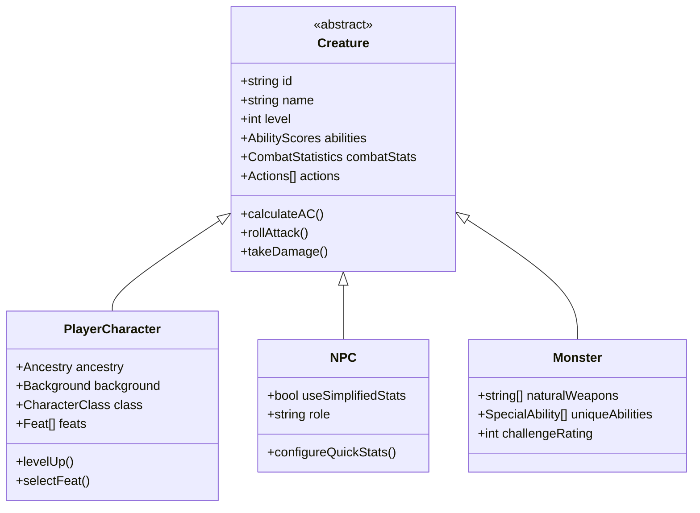

# Creature Representation Overview

## Introduction

This document provides a high-level overview of how creatures (enemies, player characters, and NPCs) are represented in the Pathfinder 2e combat tactics game. The design ensures comprehensive support for all Pathfinder 2e combat rules while maintaining extensibility for future content.

## Core Concept

All combatants in the game share a common base representation called a **Creature**. Whether it's a player character, an enemy monster, or an NPC, they all use the same fundamental structure with variations in how certain components are populated and used.

## Creature Types

### Player Characters (PCs)
- Full character creation and customization
- Class-based progression with level advancement
- Extensive feat selection and customization
- Player-controlled equipment and inventory management
- Detailed background and ancestry choices

### Non-Player Characters (NPCs)
- Can be built like PCs with full class features
- Or use simplified stat blocks for quick setup
- May have unique abilities not available to PCs
- Often have pre-configured equipment sets

### Enemies/Monsters
- Usually simpler stat blocks focused on combat
- Unique abilities and special attacks
- May have unusual traits not found in PC options
- Often have natural weapons and innate abilities

## Core Components

Every creature consists of the following major components:

### 1. Identity and Metadata
- **Name**: The creature's identifier
- **Type**: Classification (PC, NPC, Monster)
- **Level**: Power level (0-20+ for PCs, -1 to 25+ for monsters)
- **Rarity**: Common, Uncommon, Rare, or Unique
- **Size**: Tiny, Small, Medium, Large, Huge, Gargantuan
- **Alignment**: Lawful/Chaotic, Good/Evil, or Neutral variations
- **Traits**: Descriptive keywords (humanoid, dragon, undead, etc.)

### 2. Ability Scores
The six core ability scores that define a creature's basic capabilities:
- **Strength (STR)**: Physical power
- **Dexterity (DEX)**: Agility and reflexes
- **Constitution (CON)**: Endurance and health
- **Intelligence (INT)**: Reasoning and memory
- **Wisdom (WIS)**: Awareness and insight
- **Charisma (CHA)**: Presence and force of personality

Each ability has:
- Base score (typically 10 for humans, varies for monsters)
- Modifier (derived from score: (score - 10) / 2)
- Various boosts from ancestry, class, level-ups, and items

### 3. Defenses
- **Armor Class (AC)**: Defense against attacks
- **Hit Points (HP)**: Current and maximum health
- **Saving Throws**: Fortitude, Reflex, and Will saves
- **Resistances**: Damage type reduction
- **Immunities**: Complete immunity to damage types or conditions
- **Weaknesses**: Additional vulnerability to specific damage types

### 4. Offenses
- **Strikes/Attacks**: Melee and ranged attacks
- **Damage**: Base damage, damage dice, and modifiers
- **Attack Bonuses**: Proficiency + ability modifier + item bonus
- **Special Attacks**: Unique offensive capabilities

### 5. Proficiencies and Skills
- **Class DC**: For class-specific abilities
- **Spell DC**: For spellcasting (if applicable)
- **Skills**: Trained skills with proficiency levels
- **Weapon Proficiencies**: Training with weapon categories
- **Armor Proficiencies**: Training with armor types

### 6. Actions and Abilities
- **Actions**: Things the creature can do during combat
  - Single actions (1 action)
  - Two-action activities (2 actions)
  - Three-action activities (3 actions)
  - Free actions (0 actions)
  - Reactions (triggered responses)
- **Passive Abilities**: Always-active effects
- **Special Abilities**: Unique capabilities specific to the creature

### 7. Movement
- **Base Speed**: Ground movement in feet
- **Special Movement**: Fly, swim, burrow, climb speeds
- **Movement Restrictions**: Conditions affecting movement

### 8. Senses and Perception
- **Perception**: Awareness and initiative modifier
- **Special Senses**: Darkvision, low-light vision, tremorsense, etc.
- **Sense Range**: Distance for special senses

### 9. Languages
- Languages known by the creature
- Special communication abilities (telepathy, etc.)

### 10. Equipment and Inventory
- **Worn Items**: Armor, weapons, accessories
- **Carried Items**: General inventory
- **Magical Items**: Special items with abilities
- **Consumables**: Potions, scrolls, etc.

### 11. Class and Ancestry (for PCs/NPCs)
- **Ancestry**: Racial traits and heritage
- **Heritage**: Specific ancestry variation
- **Background**: Character history benefits
- **Class**: Primary class and archetype
- **Class Features**: Abilities gained from class
- **Feats**: Selected feats by category and level

### 12. Spellcasting (if applicable)
- **Tradition**: Arcane, Divine, Occult, or Primal
- **Spellcasting Ability**: Key ability for spell DC and attack
- **Spell Slots**: Available slots by level
- **Spells Known/Prepared**: Creature's spell repertoire
- **Focus Points**: For focus spells
- **Cantrips**: At-will spells

## Hierarchical Structure

The creature system uses a hierarchical, component-based structure:

```mermaid
graph TD
    A[Creature Base] --> B[Core Identity]
    A --> C[Ability Scores]
    A --> D[Combat Statistics]
    A --> E[Skills and Perception]
    A --> F[Actions and Abilities]
    A --> G[Character Progression]
    A --> H[Spellcasting]
    A --> I[Equipment]
    A --> J[Active Effects]
    A --> K[Movement and Senses]
    
    B --> B1[Metadata]
    B --> B2[Traits]
    
    C --> C1[Base Values]
    C --> C2[Modifiers]
    C --> C3[Temporary Adjustments]
    
    D --> D1[Defenses<br/>AC, HP, Saves]
    D --> D2[Offenses<br/>Attacks, Damage]
    D --> D3[Proficiencies]
    
    E --> E1[Skill Proficiencies]
    E --> E2[Perception Details]
    
    F --> F1[Strike Actions]
    F --> F2[Special Actions]
    F --> F3[Reactions]
    F --> F4[Passive Abilities]
    
    G --> G1[Ancestry and Heritage]
    G --> G2[Background]
    G --> G3[Class and Features]
    G --> G4[Feats]
    
    H --> H1[Spellcasting Tradition]
    H --> H2[Spell Slots]
    H --> H3[Known/Prepared Spells]
    
    I --> I1[Worn Items]
    I --> I2[Weapons and Armor]
    I --> I3[Consumables]
    
    J --> J1[Conditions]
    J --> J2[Buffs/Debuffs]
    J --> J3[Temporary Modifications]
    
    K --> K1[Movement Speeds]
    K --> K2[Special Senses]
    
    style A fill:#e1f5ff
    style C fill:#ffe1e1
    style D fill:#fff4e1
    style F fill:#e1ffe1
```

## Data-Driven Design

The system follows a data-driven approach where:

1. **Separation of Data and Logic**: Game content (abilities, spells, items) is stored as data, while game rules are implemented as logic that operates on that data.

2. **Rule References**: Rather than hardcoding rules, abilities reference rule implementations by name/ID, allowing rules to be updated independently.

3. **Effect System**: Abilities apply effects that modify statistics, rather than directly changing values. This allows for:
   - Easy tracking of what affects what
   - Simple addition/removal of temporary effects
   - Clear precedence and stacking rules

4. **Composition Over Inheritance**: Creatures are composed of components rather than using deep inheritance hierarchies. This makes it easier to mix and match features.

## Extensibility

The system is designed for extensibility:

### Adding New Creature Types
New creature types can be added by:
- Defining their base statistics
- Specifying which components they use
- Creating templates for quick generation

### Adding New Abilities
New abilities can be added without code changes:
- Define ability data (name, description, action cost)
- Specify effects and targeting
- Reference existing rule implementations or create new ones

### Adding New Classes/Ancestries
New character options are data additions:
- Specify progression tables
- Define class features by level
- List available feats and options

### Adding New Items
New equipment and items follow standard templates:
- Define base statistics
- Specify magical properties or runes
- Set usage and activation rules

## Validation and Consistency

The system ensures data consistency through:

1. **Type Checking**: All data has defined types and validation rules
2. **Dependency Tracking**: Changes to one stat automatically update dependent stats
3. **Rule Enforcement**: Game rules are enforced at the data level
4. **Reference Integrity**: All references (to abilities, items, etc.) are validated

## Performance Considerations

The design prioritizes:

1. **Efficient Calculations**: Combat statistics are calculated efficiently, with caching where appropriate
2. **Lazy Loading**: Optional components (like extensive spell lists) are loaded only when needed
3. **Event-Driven Updates**: Statistics update only when their dependencies change
4. **Batch Operations**: Multiple changes can be batched to avoid redundant recalculations

## Comparison with PF2e Rules

This design comprehensively covers Pathfinder 2e rules including:

- ✅ All ability scores and modifiers
- ✅ Three-action economy
- ✅ Proficiency system (Untrained, Trained, Expert, Master, Legendary)
- ✅ Multiple attack penalty
- ✅ Conditions and their effects
- ✅ Four magical traditions
- ✅ Ancestry, Background, Class structure
- ✅ Feat system with prerequisites
- ✅ Item runes and upgrades
- ✅ Hero points and other metacurrency
- ✅ Shields and shield mechanics
- ✅ Resistance, weakness, and immunity
- ✅ Spell heightening
- ✅ Focus spells and focus points

## Next Steps

For detailed specifications:
- [Core Attributes](core-attributes.md) - Ability scores and modifiers
- [Combat Statistics](combat-statistics.md) - AC, HP, saves, and attacks
- [Actions and Abilities](actions-and-abilities.md) - Action system details
- [Data Structures](data-structures.md) - Technical implementation details
