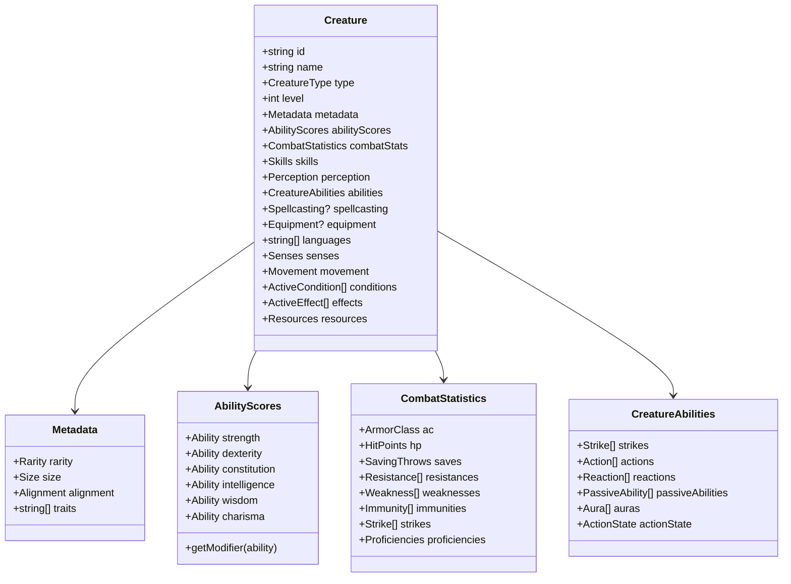

# Data Structures and Relationships

## Overview

This document provides technical specifications for the data structures used in the creature representation system, including relationships between components and implementation considerations.

## Core Type Definitions

### Primitive Types

```typescript
// Enumerations
enum ProficiencyLevel {
  Untrained = 0,
  Trained = 1,
  Expert = 2,
  Master = 3,
  Legendary = 4
}

enum Size {
  Tiny = "tiny",
  Small = "small",
  Medium = "medium",
  Large = "large",
  Huge = "huge",
  Gargantuan = "gargantuan"
}

enum Alignment {
  LG = "lawful-good",
  NG = "neutral-good",
  CG = "chaotic-good",
  LN = "lawful-neutral",
  N = "neutral",
  CN = "chaotic-neutral",
  LE = "lawful-evil",
  NE = "neutral-evil",
  CE = "chaotic-evil"
}

enum Rarity {
  Common = "common",
  Uncommon = "uncommon",
  Rare = "rare",
  Unique = "unique"
}

enum DamageType {
  // Physical
  Bludgeoning = "bludgeoning",
  Piercing = "piercing",
  Slashing = "slashing",
  
  // Energy
  Acid = "acid",
  Cold = "cold",
  Electricity = "electricity",
  Fire = "fire",
  Sonic = "sonic",
  
  // Special
  Force = "force",
  Positive = "positive",
  Negative = "negative",
  Mental = "mental",
  Poison = "poison",
  Bleed = "bleed",
  
  // Alignment
  Chaotic = "chaotic",
  Evil = "evil",
  Good = "good",
  Lawful = "lawful"
}

enum ActionType {
  Action = "action",
  Reaction = "reaction",
  Free = "free",
  Passive = "passive"
}
```

### Base Creature Structure



```typescript
interface Creature {
  // Identity
  id: string;
  name: string;
  type: "pc" | "npc" | "monster";
  level: number;
  
  // Metadata
  metadata: {
    rarity: Rarity;
    size: Size;
    alignment: Alignment;
    traits: string[];
  };
  
  // Core Components
  abilityScores: AbilityScores;
  combatStats: CombatStatistics;
  skills: Skills;
  perception: Perception;
  
  // Character Progression (optional)
  ancestry?: Ancestry;
  heritage?: Heritage;
  background?: Background;
  class?: CharacterClass;
  
  // Abilities
  abilities: CreatureAbilities;
  
  // Spellcasting (optional)
  spellcasting?: Spellcasting;
  
  // Equipment
  equipment?: Equipment;
  
  // Languages and Senses
  languages: string[];
  senses: Senses;
  movement: Movement;
  
  // Active State
  conditions: ActiveCondition[];
  effects: ActiveEffect[];
  
  // Resources
  resources: {
    heroPoints?: number;
    focusPoints?: { current: number; max: number };
    other?: { [key: string]: { current: number; max: number } };
  };
}
```

### Ability Scores

```typescript
interface AbilityScores {
  strength: Ability;
  dexterity: Ability;
  constitution: Ability;
  intelligence: Ability;
  wisdom: Ability;
  charisma: Ability;
}

interface Ability {
  // Core Values
  score: number;
  modifier: number;  // Calculated: (score - 10) / 2
  
  // For PCs - tracking boosts
  baseScore?: number;
  boosts?: {
    ancestry: number;
    background: number;
    class: number;
    level: number;
    apex: boolean;
  };
  
  // Temporary Modifiers
  statusBonus: number;
  statusPenalty: number;
  itemBonus: number;
  untypedModifiers: number[];
  
  // Conditions
  conditions: {
    name: string;
    value: number;
    source: string;
  }[];
}
```

### Combat Statistics

```typescript
interface CombatStatistics {
  // Defenses
  armorClass: ArmorClass;
  hitPoints: HitPoints;
  saves: SavingThrows;
  
  // Defensive Properties
  resistances: Resistance[];
  weaknesses: Weakness[];
  immunities: Immunity[];
  
  // Offenses
  strikes: Strike[];
  
  // Proficiencies
  proficiencies: Proficiencies;
  
  // State
  multipleAttackPenalty: number;
  actionsRemaining: number;
  reactionUsed: boolean;
}

interface ArmorClass {
  total: number;
  base: number;  // Always 10
  dexModifier: number;
  dexCap: number | null;
  proficiencyBonus: number;
  proficiency: ProficiencyLevel;
  itemBonus: number;
  statusBonus: number;
  circumstanceBonus: number;
  penalties: number;
  shieldBonus: number;
  
  armorWorn?: {
    id: string;
    name: string;
    category: "unarmored" | "light" | "medium" | "heavy";
    acBonus: number;
    dexCap: number | null;
    checkPenalty: number;
    speedPenalty: number;
    traits: string[];
  };
  
  shield?: {
    id: string;
    name: string;
    raised: boolean;
    acBonus: number;
    hardness: number;
    hp: { current: number; max: number };
    brokenThreshold: number;
  };
}

interface HitPoints {
  current: number;
  max: number;
  temporary: number;
  
  // For PCs
  calculation?: {
    ancestry: number;
    class: number;
    constitution: number;
    other: number;
  };
  
  // Special Healing
  fastHealing?: number;
  regeneration?: {
    amount: number;
    weakness: string[];
  };
  
  // Dying Rules
  dying: number;
  wounded: number;
  doomed: number;
}

interface SavingThrows {
  fortitude: Save;
  reflex: Save;
  will: Save;
  
  allSaves: {
    statusBonus: number;
    circumstanceBonus: number;
    penalties: number;
  };
}

interface Save {
  total: number;
  abilityModifier: number;
  proficiency: ProficiencyLevel;
  proficiencyBonus: number;
  itemBonus: number;
  statusBonus: number;
  circumstanceBonus: number;
  penalties: number;
  specialNotes?: string;
}
```

### Abilities and Actions

```typescript
interface CreatureAbilities {
  // Action Collections
  strikes: Strike[];
  actions: Action[];
  reactions: Reaction[];
  freeActions: Action[];
  passiveAbilities: PassiveAbility[];
  
  // Special Abilities
  auras: Aura[];
  triggeredAbilities: TriggeredAbility[];
  
  // Active Effects
  activeEffects: {
    effect: Effect;
    source: string;
    duration: Duration;
    turnsRemaining: number | null;
  }[];
  
  // State
  actionState: {
    actionsRemaining: number;
    reactionUsed: boolean;
    flourishUsed: boolean;
    stance: string | null;
  };
}

interface Action {
  id: string;
  name: string;
  description: string;
  
  actionCost: {
    actions: 0 | 1 | 2 | 3;
    type: ActionType;
    trigger?: string;
    requirements?: string;
    frequency?: string;
  };
  
  category: "offensive" | "defensive" | "movement" | "skill" | "interaction" | "passive";
  traits: string[];
  
  skill?: {
    name: string;
    minimumProficiency: ProficiencyLevel | null;
    DC: number | "varies";
  };
  
  effects: Effect[];
  
  outcomes?: {
    criticalSuccess?: string;
    success?: string;
    failure?: string;
    criticalFailure?: string;
  };
  
  usableWhen: Condition[];
  cooldown?: number;
  
  source: {
    type: "basic" | "skill" | "feat" | "class" | "ancestry" | "item" | "spell";
    reference: string;
  };
}

interface Strike {
  id: string;
  name: string;
  type: "melee" | "ranged";
  
  attackModifier: {
    total: number;
    abilityModifier: number;
    proficiencyBonus: number;
    proficiency: ProficiencyLevel;
    itemBonus: number;
    statusBonus: number;
    circumstanceBonus: number;
    penalties: number;
  };
  
  damageRolls: {
    dice: string;  // "2d8", "1d6+4", etc.
    damageType: DamageType;
    abilityModifier: number | null;
    additionalDamage?: {
      dice: string;
      type: DamageType;
      condition?: string;
    }[];
  }[];
  
  range?: {
    increment: number;
    max: number;
  };
  
  reach: number;
  traits: string[];
  attackEffects: string[];
  criticalEffects?: string[];
  
  weapon?: {
    id: string;
    name: string;
  };
}
```

### Spellcasting

```typescript
interface Spellcasting {
  tradition: "arcane" | "divine" | "occult" | "primal";
  spellcastingAbility: "intelligence" | "wisdom" | "charisma";
  
  proficiency: ProficiencyLevel;
  spellDC: number;
  spellAttack: number;
  
  spellSlots: {
    [level: string]: {  // "cantrips", "1st", "2nd", etc.
      current: number;
      max: number;
    };
  };
  
  // For prepared casters
  preparedSpells?: {
    [level: string]: string[];  // Spell IDs
  };
  
  // For spontaneous casters
  spellsKnown?: {
    [level: string]: string[];  // Spell IDs
  };
  
  // Focus spells
  focusSpells?: {
    spells: string[];  // Spell IDs
    focusPoints: { current: number; max: number };
  };
  
  // Innate spells (for monsters)
  innateSpells?: {
    [level: string]: {
      spells: string[];
      uses?: { current: number; max: number };
    };
  };
}

interface Spell {
  id: string;
  name: string;
  description: string;
  
  level: number;  // 0-10
  tradition: ("arcane" | "divine" | "occult" | "primal")[];
  school: string;
  
  actionCost: {
    actions: 1 | 2 | 3;
    type: "action" | "reaction";
  };
  
  components: ("somatic" | "verbal" | "material" | "focus")[];
  requirements?: string;
  trigger?: string;
  
  range: number | "touch" | "unlimited";
  area?: {
    type: "burst" | "cone" | "emanation" | "line";
    size: number;
  };
  targets: string;
  
  duration: Duration;
  sustained: boolean;
  dismissible: boolean;
  
  savingThrow?: {
    type: "fortitude" | "reflex" | "will";
    basic: boolean;
    onSuccess?: string;
    onCriticalSuccess?: string;
    onFailure?: string;
    onCriticalFailure?: string;
  };
  
  effects: Effect[];
  
  heightened?: {
    [level: number]: {
      changes: string;
      effectChanges?: Effect[];
    };
  };
  
  traits: string[];
}
```

### Character Progression

```typescript
interface Ancestry {
  id: string;
  name: string;
  description: string;
  
  size: Size;
  speed: number;
  
  abilityBoosts: {
    free: number;
    fixed: ("strength" | "dexterity" | "constitution" | "intelligence" | "wisdom" | "charisma")[];
  };
  abilityFlaws: ("strength" | "dexterity" | "constitution" | "intelligence" | "wisdom" | "charisma")[];
  
  hitPoints: number;
  languages: string[];
  additionalLanguages: number;
  
  features: string[];  // Feature IDs
  senses: { type: string; range: number | null }[];
  
  heritages: string[];  // Heritage IDs
  traits: string[];
  rarity: Rarity;
}

interface CharacterClass {
  id: string;
  name: string;
  keyAbility: ("strength" | "dexterity" | "constitution" | "intelligence" | "wisdom" | "charisma")[];
  hitPoints: number;
  
  initialProficiencies: {
    perception: ProficiencyLevel;
    saves: {
      fortitude: ProficiencyLevel;
      reflex: ProficiencyLevel;
      will: ProficiencyLevel;
    };
    weapons: {
      simple: ProficiencyLevel;
      martial: ProficiencyLevel;
      advanced: ProficiencyLevel;
      unarmed: ProficiencyLevel;
      specific?: string[];
    };
    armor: {
      unarmored: ProficiencyLevel;
      light: ProficiencyLevel;
      medium: ProficiencyLevel;
      heavy: ProficiencyLevel;
    };
    skills: {
      trained: number;
      keySkills: string[];
    };
    classDC: ProficiencyLevel;
  };
  
  progression: {
    [level: number]: {
      classFeatures: string[];
      abilityBoosts: number;
      skillIncreases: number;
      generalFeats: number;
      skillFeats: number;
      classFeats: number;
      ancestryFeats: number;
      proficiencyIncreases: {
        category: string;
        to: ProficiencyLevel;
      }[];
    };
  };
}

interface Feat {
  id: string;
  name: string;
  description: string;
  
  type: "class" | "skill" | "general" | "ancestry";
  level: number;
  
  prerequisites: {
    level?: number;
    abilities?: { ability: string; minimum: number }[];
    skills?: { skill: string; minimumProficiency: ProficiencyLevel }[];
    feats?: string[];
    classes?: string[];
    other?: string;
  };
  
  grants: {
    actions?: string[];
    passiveAbilities?: string[];
    modifiers?: Modifier[];
    proficiencyIncreases?: { category: string; amount: number }[];
    specialBenefits?: string;
  };
  
  choices?: {
    type: "skill" | "weapon" | "spell" | "general";
    options: string[] | null;
    count: number;
  }[];
  
  frequency?: string;
  traits: string[];
}
```

### Effects and Conditions

```typescript
interface Effect {
  id: string;
  type: EffectType;
  targets: TargetSpecification;
  duration: Duration;
  applicationData: any;  // Type-specific data
  conditions: Condition[];
}

enum EffectType {
  Damage = "damage",
  Heal = "heal",
  ModifyStat = "modify-stat",
  ApplyCondition = "apply-condition",
  Move = "move",
  CreateObject = "create-object",
  Summon = "summon",
  Teleport = "teleport",
  Transform = "transform",
  GrantAction = "grant-action",
  RemoveCondition = "remove-condition",
  TriggerReaction = "trigger-reaction",
  Custom = "custom"
}

interface Duration {
  type: "instant" | "sustained" | "rounds" | "minutes" | "hours" | "days" | "unlimited" | "until trigger" | "concentration";
  value?: number;
  unit?: "round" | "minute" | "hour" | "day";
  endCondition?: string;
  sustainAction?: { actions: number; type: ActionType };
  maxSustains?: number;
  startTiming: "immediately" | "start of next turn" | "end of turn";
  endTiming: "start of turn" | "end of turn" | "immediately";
}

interface ActiveCondition {
  name: string;
  value: number | null;  // For conditions with values (frightened 2, clumsy 1, etc.)
  duration: Duration;
  source: string;
  effects: Modifier[];
}

interface Condition {
  id: string;
  name: string;
  description: string;
  
  hasValue: boolean;  // Does this condition have numeric value?
  maxValue?: number;
  
  effects: Modifier[];
  
  overrides: string[];  // Conditions this replaces
  overriddenBy: string[];  // Conditions that replace this
  
  group?: string;  // Conditions in same group don't stack
}
```

### Modifiers

```typescript
interface Modifier {
  type: "status" | "circumstance" | "item" | "untyped";
  target: string;  // What stat this modifies
  value: number;
  operation: "add" | "multiply" | "set";
  condition?: string;  // When this applies
}

interface TargetSpecification {
  type: "self" | "creature" | "area" | "point";
  count?: number;
  filter?: string;  // Conditions for valid targets
  range?: number;
  areaType?: "burst" | "cone" | "emanation" | "line";
  areaSize?: number;
}
```

### Equipment

```typescript
interface Equipment {
  worn: Item[];
  weapons: Weapon[];
  carried: Item[];
  
  totalBulk: number;
  bulkLimit: number;
}

interface Item {
  id: string;
  name: string;
  description: string;
  
  type: "weapon" | "armor" | "consumable" | "worn" | "held" | "material";
  level: number;
  price: { gp: number; sp: number; cp: number };
  bulk: number;
  
  usage: string;
  activationCost?: { actions: number; type: ActionType };
  
  effects: Effect[];
  grantedAbilities: string[];
  
  magical: boolean;
  traits: string[];
  rarity: Rarity;
  
  quantity: number;
}

interface Weapon extends Item {
  category: "simple" | "martial" | "advanced" | "unarmed";
  group: string;
  
  damage: {
    dice: string;
    type: DamageType;
  };
  
  hands: "1" | "2" | "1+";
  range?: { increment: number; max: number };
  reach?: number;
  reload?: number;
  
  potencyRune: number | null;
  strikingRune: "striking" | "greater striking" | "major striking" | null;
  propertyRunes: string[];
  
  weaponTraits: string[];
}
```

## Relationship Diagrams

### Component Dependencies

```
Creature
├── AbilityScores
│   └── Used by: CombatStats, Skills, Saves, Spells
├── CombatStatistics
│   ├── ArmorClass (depends on: DEX, Armor, Shield)
│   ├── HitPoints (depends on: CON, Level, Class)
│   ├── Saves (depends on: Abilities, Proficiencies)
│   └── Strikes (depends on: Abilities, Weapons, Proficiencies)
├── Skills (depends on: Abilities, Proficiencies)
├── Perception (depends on: WIS, Proficiencies)
├── Movement (depends on: Armor, Conditions)
├── Abilities
│   ├── Actions (may depend on: Abilities, Skills, Equipment)
│   ├── Strikes (depend on: Abilities, Weapons)
│   └── PassiveAbilities
├── Spellcasting (depends on: Spellcasting Ability, Level)
└── Equipment
    ├── Weapons → Strikes
    ├── Armor → AC, Movement
    └── Items → Abilities, Effects
```

### Data Flow

```
User Action
    ↓
Action Validation
    ↓
Cost Application (actions, resources)
    ↓
Effect Resolution
    ↓
    ├→ Stat Modifications
    │   ├→ Temporary Modifiers
    │   └→ Condition Application
    ├→ Damage Calculation
    │   ├→ Apply Resistance/Weakness
    │   └→ Update HP
    ├→ Movement Changes
    └→ State Updates
        ↓
Game State Updated
    ↓
UI/Output Updated
```

## Implementation Considerations

### Calculation Order

When calculating derived statistics:

1. **Base Value**: Get the fundamental value
2. **Permanent Modifiers**: Apply level, proficiency, ability modifiers
3. **Item Bonuses**: Apply (highest only)
4. **Status Bonuses**: Apply (highest only)
5. **Circumstance Bonuses**: Apply (highest only)
6. **Untyped Bonuses**: Apply (all stack)
7. **Penalties**: Apply (all stack)
8. **Conditions**: Apply condition effects

### Caching Strategy

For performance:

- **Cache Derived Values**: AC, save totals, attack bonuses
- **Invalidate on Change**: When base stats or modifiers change
- **Lazy Recalculation**: Only recalculate when needed
- **Batch Updates**: Group multiple changes before recalculating

### Validation Rules

All data must satisfy:

1. ✅ Required fields are present
2. ✅ Values are within valid ranges
3. ✅ References (IDs) point to existing content
4. ✅ Prerequisites are met
5. ✅ Stacking rules are followed
6. ✅ Action economy is respected

## Related Documents

- [Creature Representation Overview](creature-representation-overview.md) - High-level architecture
- [Examples](examples.md) - Concrete implementations
- [Extensibility Guide](extensibility-guide.md) - Adding new content
