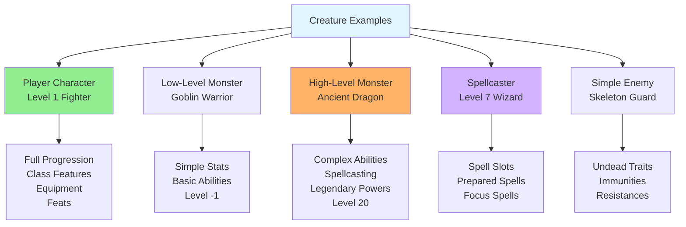

# Examples

## Overview

This document provides concrete examples of creature representations, demonstrating how different types of creatures are constructed using the system.



## Example 1: Level 1 Human Fighter (Player Character)

A complete player character with full details.

```json
{
  "id": "pc-fighter-1",
  "name": "Valeros",
  "type": "pc",
  "level": 1,
  
  "metadata": {
    "rarity": "common",
    "size": "medium",
    "alignment": "chaotic good",
    "traits": ["human", "humanoid"]
  },
  
  "ancestry": {
    "id": "human",
    "name": "Human",
    "heritage": {
      "id": "versatile-heritage",
      "name": "Versatile Heritage",
      "benefits": "Gain a general feat at 1st level"
    }
  },
  
  "background": {
    "id": "warrior",
    "name": "Warrior",
    "abilityBoosts": ["strength", "constitution"]
  },
  
  "class": {
    "id": "fighter",
    "name": "Fighter",
    "keyAbility": "strength",
    "features": ["attack-of-opportunity", "shield-block"]
  },
  
  "abilityScores": {
    "strength": {
      "score": 18,
      "modifier": 4,
      "sources": {
        "ancestry": 2,
        "background": 2,
        "class": 2,
        "free": 2
      }
    },
    "dexterity": {
      "score": 14,
      "modifier": 2,
      "sources": { "free": 4 }
    },
    "constitution": {
      "score": 14,
      "modifier": 2,
      "sources": { "background": 2, "free": 2 }
    },
    "intelligence": {
      "score": 10,
      "modifier": 0
    },
    "wisdom": {
      "score": 12,
      "modifier": 1,
      "sources": { "free": 2 }
    },
    "charisma": {
      "score": 10,
      "modifier": 0
    }
  },
  
  "hitPoints": {
    "max": 20,
    "current": 20,
    "temporary": 0,
    "calculation": {
      "ancestry": 8,
      "class": 10,
      "constitution": 2
    }
  },
  
  "armorClass": {
    "total": 18,
    "base": 10,
    "dexModifier": 2,
    "proficiencyBonus": 4,
    "itemBonus": 2,
    "armorWorn": {
      "name": "Scale Mail",
      "category": "medium",
      "acBonus": 2,
      "dexCap": 2,
      "checkPenalty": -2,
      "speedPenalty": -5
    }
  },
  
  "savingThrows": {
    "fortitude": {
      "total": 7,
      "abilityModifier": 2,
      "proficiency": "expert",
      "proficiencyBonus": 5
    },
    "reflex": {
      "total": 5,
      "abilityModifier": 2,
      "proficiency": "trained",
      "proficiencyBonus": 3
    },
    "will": {
      "total": 4,
      "abilityModifier": 1,
      "proficiency": "trained",
      "proficiencyBonus": 3
    }
  },
  
  "perception": {
    "total": 4,
    "wisdomModifier": 1,
    "proficiency": "trained",
    "proficiencyBonus": 3
  },
  
  "movement": {
    "land": 20,
    "speedPenalty": -5,
    "currentSpeed": 20
  },
  
  "skills": {
    "acrobatics": { "total": 5, "trained": true },
    "athletics": { "total": 7, "trained": true },
    "intimidation": { "total": 3, "trained": true }
  },
  
  "strikes": [
    {
      "name": "Longsword",
      "type": "melee",
      "attackModifier": {
        "total": 8,
        "abilityModifier": 4,
        "proficiencyBonus": 4,
        "itemBonus": 0
      },
      "damageRolls": [
        {
          "dice": "1d8",
          "damageType": "slashing",
          "abilityModifier": 4
        }
      ],
      "traits": ["versatile P"],
      "reach": 5
    }
  ],
  
  "reactions": [
    {
      "name": "Attack of Opportunity",
      "trigger": "A creature within your reach uses a manipulate action or a move action, makes a ranged attack, or leaves a square during a move action it's using.",
      "effect": "Make a melee Strike against the triggering creature. If the attack is a critical hit and the trigger was a manipulate action, you disrupt that action."
    },
    {
      "name": "Shield Block",
      "trigger": "While you have your shield raised, you would take damage from a physical attack.",
      "effect": "Your shield prevents you from taking an amount of damage up to the shield's Hardness. Both you and the shield take any remaining damage, possibly breaking or destroying the shield."
    }
  ],
  
  "feats": [
    {
      "type": "class",
      "name": "Power Attack",
      "level": 1,
      "grants": ["power-attack-action"]
    },
    {
      "type": "general",
      "name": "Toughness",
      "level": 1,
      "effect": "+1 HP per level, +1 current HP per level"
    }
  ],
  
  "equipment": {
    "worn": [
      {
        "name": "Scale Mail",
        "type": "armor",
        "equipped": true
      },
      {
        "name": "Steel Shield",
        "type": "shield",
        "hardness": 5,
        "hp": 20,
        "brokenThreshold": 10
      }
    ],
    "weapons": [
      {
        "name": "Longsword",
        "equipped": true,
        "hands": 1
      }
    ],
    "carried": [
      {
        "name": "Adventurer's Pack",
        "bulk": 1
      }
    ]
  }
}
```

## Example 2: Goblin Warrior (Low-Level Monster)

A simple enemy creature from the bestiary.

```json
{
  "id": "goblin-warrior",
  "name": "Goblin Warrior",
  "type": "npc",
  "level": -1,
  
  "metadata": {
    "rarity": "common",
    "size": "small",
    "alignment": "chaotic evil",
    "traits": ["goblin", "humanoid"]
  },
  
  "abilityScores": {
    "strength": { "score": 10, "modifier": 0 },
    "dexterity": { "score": 16, "modifier": 3 },
    "constitution": { "score": 12, "modifier": 1 },
    "intelligence": { "score": 10, "modifier": 0 },
    "wisdom": { "score": 10, "modifier": 0 },
    "charisma": { "score": 8, "modifier": -1 }
  },
  
  "hitPoints": {
    "max": 6,
    "current": 6
  },
  
  "armorClass": {
    "total": 16,
    "base": 10,
    "dexModifier": 3,
    "proficiencyBonus": 2,
    "itemBonus": 1
  },
  
  "savingThrows": {
    "fortitude": { "total": 3 },
    "reflex": { "total": 7 },
    "will": { "total": 2 }
  },
  
  "perception": {
    "total": 2,
    "senses": [
      {
        "type": "darkvision",
        "range": 60
      }
    ]
  },
  
  "movement": {
    "land": 25
  },
  
  "languages": ["common", "goblin"],
  
  "skills": {
    "acrobatics": { "total": 5 },
    "athletics": { "total": 2 },
    "nature": { "total": 2 },
    "stealth": { "total": 5 }
  },
  
  "strikes": [
    {
      "name": "Dogslicer",
      "type": "melee",
      "attackModifier": { "total": 7 },
      "damageRolls": [
        {
          "dice": "1d6",
          "damageType": "slashing",
          "abilityModifier": 0
        }
      ],
      "traits": ["agile", "backstabber", "finesse"],
      "reach": 5
    },
    {
      "name": "Shortbow",
      "type": "ranged",
      "attackModifier": { "total": 7 },
      "damageRolls": [
        {
          "dice": "1d6",
          "damageType": "piercing",
          "abilityModifier": 0
        }
      ],
      "range": {
        "increment": 60,
        "max": 600
      },
      "traits": ["deadly d10"]
    }
  ],
  
  "passiveAbilities": [
    {
      "name": "Goblin Scuttle",
      "category": "defensive",
      "trigger": "An ally ends a move action adjacent to the goblin.",
      "effect": "The goblin Steps."
    }
  ]
}
```

## Example 3: Ancient Red Dragon (High-Level Monster)

A powerful dragon with complex abilities and spellcasting.

```json
{
  "id": "ancient-red-dragon",
  "name": "Ancient Red Dragon",
  "type": "npc",
  "level": 20,
  
  "metadata": {
    "rarity": "uncommon",
    "size": "huge",
    "alignment": "chaotic evil",
    "traits": ["dragon", "fire"]
  },
  
  "abilityScores": {
    "strength": { "score": 28, "modifier": 9 },
    "dexterity": { "score": 18, "modifier": 4 },
    "constitution": { "score": 26, "modifier": 8 },
    "intelligence": { "score": 18, "modifier": 4 },
    "wisdom": { "score": 22, "modifier": 6 },
    "charisma": { "score": 23, "modifier": 6 }
  },
  
  "hitPoints": {
    "max": 425,
    "current": 425
  },
  
  "armorClass": {
    "total": 47,
    "base": 10,
    "dexModifier": 4,
    "proficiencyBonus": 26,
    "naturalArmor": 7
  },
  
  "savingThrows": {
    "fortitude": { "total": 36 },
    "reflex": { "total": 32 },
    "will": { "total": 34 }
  },
  
  "perception": {
    "total": 36,
    "senses": [
      {
        "type": "darkvision",
        "range": 120
      },
      {
        "type": "scent",
        "range": 60,
        "imprecise": true
      }
    ]
  },
  
  "movement": {
    "land": 60,
    "fly": 180
  },
  
  "languages": ["common", "draconic", "dwarven", "jotun", "orcish"],
  
  "skills": {
    "acrobatics": { "total": 30 },
    "athletics": { "total": 37 },
    "deception": { "total": 32 },
    "diplomacy": { "total": 32 },
    "intimidation": { "total": 36 },
    "stealth": { "total": 30 }
  },
  
  "defenses": {
    "immunities": [
      { "type": "damage", "value": "fire" },
      { "type": "condition", "value": "paralyzed" },
      { "type": "condition", "value": "sleep" }
    ]
  },
  
  "strikes": [
    {
      "name": "Jaws",
      "type": "melee",
      "attackModifier": { "total": 38 },
      "damageRolls": [
        {
          "dice": "4d10",
          "damageType": "piercing",
          "abilityModifier": 9
        },
        {
          "dice": "4d6",
          "damageType": "fire"
        }
      ],
      "reach": 20,
      "traits": ["reach 20 feet"]
    },
    {
      "name": "Claw",
      "type": "melee",
      "attackModifier": { "total": 38 },
      "damageRolls": [
        {
          "dice": "4d8",
          "damageType": "slashing",
          "abilityModifier": 9
        }
      ],
      "reach": 15,
      "traits": ["agile", "reach 15 feet"]
    },
    {
      "name": "Tail",
      "type": "melee",
      "attackModifier": { "total": 36 },
      "damageRolls": [
        {
          "dice": "4d10",
          "damageType": "bludgeoning",
          "abilityModifier": 9
        }
      ],
      "reach": 25,
      "traits": ["reach 25 feet"]
    },
    {
      "name": "Wing",
      "type": "melee",
      "attackModifier": { "total": 36 },
      "damageRolls": [
        {
          "dice": "3d8",
          "damageType": "slashing",
          "abilityModifier": 9
        }
      ],
      "reach": 20,
      "traits": ["agile", "reach 20 feet"]
    }
  ],
  
  "actions": [
    {
      "name": "Breath Weapon",
      "actionCost": { "actions": 2, "type": "action" },
      "category": "offensive",
      "frequency": "once every 1d4 rounds",
      "description": "The dragon breathes a blast of flame that deals 21d6 fire damage in a 60-foot cone (DC 46 basic Reflex save).",
      "effects": [
        {
          "type": "Damage",
          "targets": "area:cone:60",
          "damage": {
            "formula": "21d6",
            "type": "fire"
          },
          "savingThrow": {
            "type": "reflex",
            "DC": 46,
            "basic": true
          }
        }
      ],
      "traits": ["arcane", "evocation", "fire"]
    },
    {
      "name": "Draconic Frenzy",
      "actionCost": { "actions": 2, "type": "action" },
      "description": "The dragon makes two claw Strikes and one wing Strike in any order.",
      "traits": []
    },
    {
      "name": "Draconic Momentum",
      "actionCost": { "actions": 0, "type": "free" },
      "trigger": "The dragon scores a critical hit with a Strike.",
      "description": "The dragon recharges their Breath Weapon activity.",
      "traits": []
    }
  ],
  
  "spellcasting": {
    "tradition": "arcane",
    "spellcastingAbility": "charisma",
    "spellDC": 44,
    "spellAttack": 36,
    "spells": {
      "cantrips": [
        "detect-magic",
        "read-aura"
      ],
      "8th": {
        "slots": 1,
        "spells": ["wall-of-fire"]
      }
    }
  },
  
  "passiveAbilities": [
    {
      "name": "Smoke Vision",
      "description": "Smoke doesn't impair the dragon's vision; the dragon ignores the concealed condition from smoke.",
      "category": "sensory"
    },
    {
      "name": "Dragon Heat",
      "description": "The dragon's vicinity is sweltering. The dragon deals 4d6 fire damage (DC 39 basic Reflex save) to creatures that end their turn within 30 feet of the dragon.",
      "category": "defensive"
    },
    {
      "name": "Frightful Presence",
      "actionCost": { "actions": 0, "type": "free" },
      "description": "DC 44, 90 feet",
      "category": "offensive"
    }
  ]
}
```

## Example 4: Wizard with Spellcasting (Mid-Level PC)

A 7th-level wizard demonstrating spell slots and prepared spells.

```json
{
  "id": "pc-wizard-7",
  "name": "Ezren",
  "type": "pc",
  "level": 7,
  
  "class": {
    "id": "wizard",
    "name": "Wizard",
    "keyAbility": "intelligence",
    "arcaneSchool": "evocation",
    "arcaneThesis": "spell-substitution"
  },
  
  "abilityScores": {
    "intelligence": { "score": 19, "modifier": 4 },
    "dexterity": { "score": 14, "modifier": 2 },
    "constitution": { "score": 14, "modifier": 2 },
    "wisdom": { "score": 12, "modifier": 1 },
    "charisma": { "score": 10, "modifier": 0 },
    "strength": { "score": 10, "modifier": 0 }
  },
  
  "hitPoints": {
    "max": 51,
    "current": 51,
    "calculation": {
      "ancestry": 8,
      "class": 28,
      "constitution": 14,
      "other": 1
    }
  },
  
  "spellcasting": {
    "tradition": "arcane",
    "spellcastingAbility": "intelligence",
    "proficiency": "expert",
    "spellDC": 25,
    "spellAttack": 17,
    
    "spellSlots": {
      "cantrips": {
        "current": -1,
        "max": -1
      },
      "1st": { "current": 3, "max": 3 },
      "2nd": { "current": 3, "max": 3 },
      "3rd": { "current": 3, "max": 3 },
      "4th": { "current": 3, "max": 3 }
    },
    
    "preparedSpells": {
      "cantrips": [
        "electric-arc",
        "shield",
        "ray-of-frost",
        "detect-magic",
        "prestidigitation"
      ],
      "1st": [
        "magic-missile",
        "magic-missile",
        "grease"
      ],
      "2nd": [
        "invisibility",
        "mirror-image",
        "web"
      ],
      "3rd": [
        "fireball",
        "haste",
        "lightning-bolt"
      ],
      "4th": [
        "dimension-door",
        "fly",
        "wall-of-fire"
      ]
    },
    
    "spellbook": [
      "Includes all prepared spells plus:",
      "1st: burning hands, mage armor, true strike",
      "2nd: dispel magic, false life",
      "3rd: dispel magic, slow",
      "4th: resilient sphere"
    ]
  },
  
  "focusSpells": {
    "focusPoints": {
      "current": 1,
      "max": 1
    },
    "spells": [
      {
        "name": "Force Bolt",
        "tradition": "arcane",
        "level": 1,
        "description": "Evocation school focus spell"
      }
    ]
  },
  
  "feats": [
    {
      "type": "class",
      "name": "Reach Spell",
      "level": 1,
      "effect": "Increase range of spells by 30 feet"
    },
    {
      "type": "class",
      "name": "Widen Spell",
      "level": 2,
      "effect": "Increase area of burst, emanation, or line spells"
    },
    {
      "type": "class",
      "name": "Clever Counterspell",
      "level": 4,
      "effect": "Use any spell to counteract a spell of the same school"
    }
  ]
}
```

## Example 5: Simple Skeleton (Undead Enemy)

A basic undead creature with minimal complexity.

```json
{
  "id": "skeleton-guard",
  "name": "Skeleton Guard",
  "type": "npc",
  "level": 3,
  
  "metadata": {
    "rarity": "common",
    "size": "medium",
    "alignment": "neutral evil",
    "traits": ["skeleton", "undead", "mindless"]
  },
  
  "abilityScores": {
    "strength": { "score": 16, "modifier": 3 },
    "dexterity": { "score": 14, "modifier": 2 },
    "constitution": { "score": 10, "modifier": 0 },
    "intelligence": { "score": 0, "modifier": -5 },
    "wisdom": { "score": 10, "modifier": 0 },
    "charisma": { "score": 10, "modifier": 0 }
  },
  
  "hitPoints": {
    "max": 50,
    "current": 50
  },
  
  "armorClass": {
    "total": 20,
    "details": "16 without shield"
  },
  
  "savingThrows": {
    "fortitude": { "total": 9 },
    "reflex": { "total": 9 },
    "will": { "total": 7 }
  },
  
  "perception": {
    "total": 7,
    "senses": [
      {
        "type": "darkvision",
        "range": 60
      }
    ]
  },
  
  "movement": {
    "land": 25
  },
  
  "defenses": {
    "immunities": [
      { "type": "damage", "value": "death" },
      { "type": "damage", "value": "disease" },
      { "type": "damage", "value": "mental" },
      { "type": "damage", "value": "paralyzed" },
      { "type": "damage", "value": "poison" },
      { "type": "condition", "value": "unconscious" }
    ],
    "resistances": [
      { "type": "cold", "value": 5 },
      { "type": "electricity", "value": 5 },
      { "type": "fire", "value": 5 },
      { "type": "piercing", "value": 5 },
      { "type": "slashing", "value": 5 }
    ]
  },
  
  "strikes": [
    {
      "name": "Scimitar",
      "type": "melee",
      "attackModifier": { "total": 12 },
      "damageRolls": [
        {
          "dice": "1d6+7",
          "damageType": "slashing"
        }
      ],
      "traits": ["forceful", "sweep"]
    },
    {
      "name": "Claw",
      "type": "melee",
      "attackModifier": { "total": 12 },
      "damageRolls": [
        {
          "dice": "1d6+7",
          "damageType": "slashing"
        }
      ],
      "traits": ["agile"]
    }
  ],
  
  "passiveAbilities": [
    {
      "name": "Shield Block",
      "actionCost": { "actions": 0, "type": "reaction" },
      "category": "defensive"
    }
  ]
}
```

## Key Observations

### Design Patterns

1. **Consistent Structure**: All creatures follow the same base structure
2. **Scalability**: From simple goblins to complex dragons
3. **Modularity**: Each component (abilities, spells, items) is self-contained
4. **Flexibility**: Can represent PCs, NPCs, and monsters with the same system

### Data Organization

1. **Core Stats**: Always present (abilities, HP, AC, saves)
2. **Optional Components**: Spellcasting, special abilities, equipment
3. **Calculated vs Stored**: Some values calculated from others, some stored directly
4. **References**: IDs used to reference feats, spells, items from content libraries

### Extensibility

1. **New Abilities**: Easy to add through data
2. **Custom Rules**: Complex mechanics can be described narratively
3. **Content Packs**: Group related content together
4. **Validation**: Structure supports automated validation

## Related Documents

- [Creature Representation Overview](creature-representation-overview.md) - System architecture
- [Core Attributes](core-attributes.md) - Ability score details
- [Combat Statistics](combat-statistics.md) - Combat stat calculations
- [Actions and Abilities](actions-and-abilities.md) - Action system details
- [Extensibility Guide](extensibility-guide.md) - Adding new content
