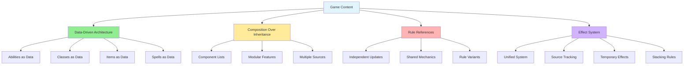
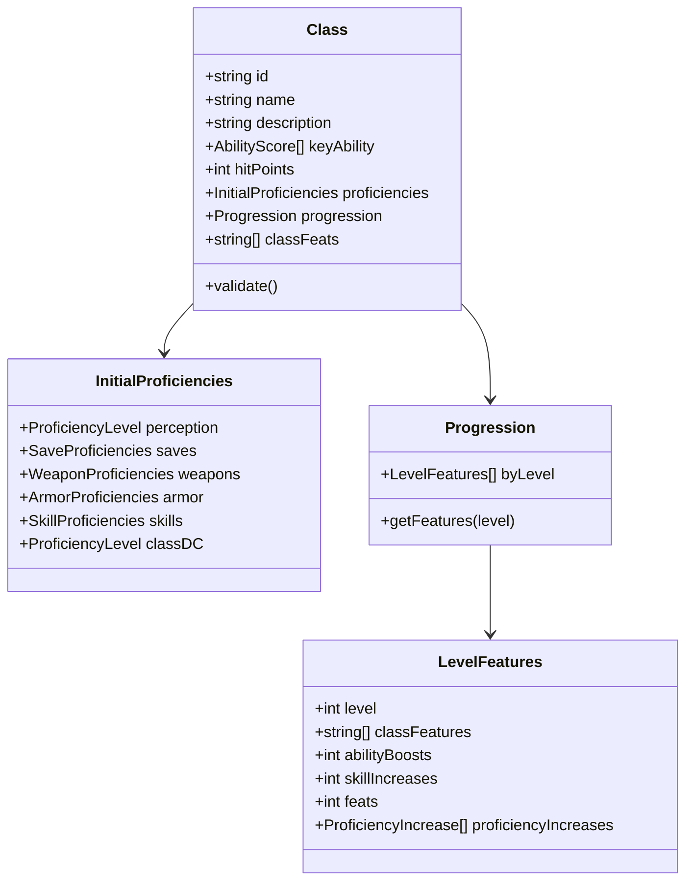

# Extensibility Guide

## Overview

The creature representation system is designed to be highly extensible, allowing new content to be added without modifying existing code structures. This document provides guidelines for extending the system with new classes, feats, ancestries, spells, items, and other game content.

## Design Principles for Extensibility



### 1. Data-Driven Architecture
All game content is defined as data, not code:
- **Abilities** are data entries with references to rule implementations
- **Classes** are defined through progression tables and feature lists
- **Items** are data objects with property definitions
- **Spells** are data with targeting, effects, and heightening information

### 2. Composition Over Inheritance
Components are composed rather than inherited:
- Creatures have lists of abilities, not ability inheritance hierarchies
- Features are applied as modular components
- Multiple sources can grant the same or similar abilities

### 3. Rule References
Content references rules by name/ID rather than implementing them inline:
- Allows rules to be updated independently
- Enables sharing of common mechanics
- Facilitates rule variations and house rules

### 4. Effect System
Changes to game state are handled through a unified effect system:
- All modifications go through the effect system
- Easy to track sources and dependencies
- Simple addition/removal of temporary effects
- Clear stacking and precedence rules

## Adding New Content

### Adding a New Class



Classes are defined through structured data that includes:

```
Class {
  // Identity
  id: string,
  name: string,
  description: string,
  
  // Core Properties
  keyAbility: AbilityScore[],       // STR or DEX for Fighter
  hitPoints: integer,               // HP per level
  
  // Initial Proficiencies
  proficiencies: {
    perception: ProficiencyLevel,
    fortitude: ProficiencyLevel,
    reflex: ProficiencyLevel,
    will: ProficiencyLevel,
    
    weapons: {
      category: {
        simple: ProficiencyLevel,
        martial: ProficiencyLevel,
        advanced: ProficiencyLevel,
        unarmed: ProficiencyLevel
      },
      specific: string[]            // Specific weapon proficiencies
    },
    
    armor: {
      unarmored: ProficiencyLevel,
      light: ProficiencyLevel,
      medium: ProficiencyLevel,
      heavy: ProficiencyLevel
    },
    
    skills: {
      trained: integer,             // Number of trained skills at 1st level
      keySkills: string[]           // Recommended/signature skills
    },
    
    classDC: ProficiencyLevel
  },
  
  // Progression
  progression: {
    [level: number]: {
      // Features gained at this level
      classFeatures: string[],      // IDs of class features
      abilityBoosts: integer,       // Number of ability boosts
      skillIncreases: integer,      // Number of skill increases
      generalFeats: integer,        // General feat selections
      skillFeats: integer,          // Skill feat selections
      classFeats: integer,          // Class feat selections
      ancestryFeats: integer,       // Ancestry feat selections (rare)
      
      // Proficiency Increases
      proficiencyIncreases: {
        category: string,           // What's being increased
        to: ProficiencyLevel        // New proficiency level
      }[]
    }
  },
  
  // Available Feats
  classFeats: {
    [level: number]: string[]       // IDs of available feats at each level
  }
}
```

**Example: Adding the Barbarian Class**
```
{
  id: "barbarian",
  name: "Barbarian",
  keyAbility: ["strength"],
  hitPoints: 12,
  
  proficiencies: {
    perception: "expert",
    fortitude: "expert",
    reflex: "trained",
    will: "trained",
    
    weapons: {
      category: {
        simple: "trained",
        martial: "trained",
        advanced: "untrained",
        unarmed: "trained"
      }
    },
    
    armor: {
      unarmored: "trained",
      light: "trained",
      medium: "trained",
      heavy: "untrained"
    },
    
    skills: {
      trained: 3,
      keySkills: ["athletics", "intimidation"]
    },
    
    classDC: "trained"
  },
  
  progression: {
    1: {
      classFeatures: ["rage", "instinct", "barbarian-feats"],
      abilityBoosts: 0,
      skillIncreases: 0,
      generalFeats: 0,
      skillFeats: 0,
      classFeats: 1
    },
    2: {
      classFeatures: [],
      classFeats: 1,
      skillFeats: 1
    }
    // ... continue for all 20 levels
  }
}
```

### Adding a New Feat

Feats grant specific abilities or modify existing ones:

```
Feat {
  // Identity
  id: string,
  name: string,
  description: string,
  
  // Classification
  type: "class" | "skill" | "general" | "ancestry",
  level: integer,
  
  // Prerequisites
  prerequisites: {
    level: integer | null,
    abilities: {
      ability: AbilityScore,
      minimum: integer
    }[],
    skills: {
      skill: string,
      minimumProficiency: ProficiencyLevel
    }[],
    feats: string[],              // Required feat IDs
    classes: string[],            // Required class membership
    other: string                 // Narrative prerequisites
  },
  
  // Benefits
  grants: {
    // New abilities
    actions: string[],            // Action IDs granted
    passiveAbilities: string[],
    
    // Stat modifications
    modifiers: StatModifier[],
    
    // Proficiency increases
    proficiencyIncreases: {
      category: string,
      amount: integer
    }[],
    
    // Special benefits
    specialBenefits: string       // Narrative/complex benefits
  },
  
  // Feat-specific data
  choices: {
    type: "skill" | "weapon" | "spell" | "general",
    options: string[] | null,     // null = any valid choice
    count: integer                // How many choices
  }[],
  
  // Frequency
  frequency: string | null,       // "once per day", "once per hour", etc.
  
  // Traits
  traits: string[]
}
```

**Example: Adding "Power Attack" Feat**
```
{
  id: "power-attack",
  name: "Power Attack",
  description: "You unleash a particularly powerful attack that clobbers your foe but leaves you a bit unsteady.",
  type: "class",
  level: 1,
  
  prerequisites: {
    classes: ["fighter"]
  },
  
  grants: {
    actions: ["power-attack-action"]
  },
  
  traits: ["fighter", "flourish"]
}

// Corresponding Action:
{
  id: "power-attack-action",
  name: "Power Attack",
  actionCost: { actions: 2, type: "action" },
  category: "offensive",
  traits: ["flourish"],
  
  description: "Make a melee Strike. It gains a circumstance bonus to damage equal to twice the number of weapon damage dice.",
  
  effects: [
    {
      type: "ModifyStat",
      targets: "self.nextStrike",
      modification: {
        stat: "damage",
        modifierType: "circumstance",
        value: "weapon.damageDice * 2"
      }
    }
  ]
}
```

### Adding a New Ancestry

Ancestries define a character's heritage and starting features:

```
Ancestry {
  // Identity
  id: string,
  name: string,
  description: string,
  
  // Physical Properties
  size: "tiny" | "small" | "medium" | "large" | "huge" | "gargantuan",
  speed: integer,
  
  // Ability Boosts/Flaws
  abilityBoosts: {
    free: integer,                // Number of free boosts
    fixed: AbilityScore[]         // Specific required boosts
  },
  abilityFlaws: AbilityScore[],
  
  // Starting Features
  hitPoints: integer,             // Bonus HP
  languages: string[],            // Starting languages
  additionalLanguages: integer,   // Number of additional language choices
  
  // Special Abilities
  features: string[],             // IDs of ancestry features
  
  // Senses
  senses: {
    type: string,
    range: integer | null
  }[],
  
  // Heritages
  heritages: string[],            // Available heritage IDs
  
  // Feats
  ancestryFeats: {
    [level: number]: string[]     // Available feats by level
  },
  
  // Traits
  traits: string[],
  rarity: "common" | "uncommon" | "rare" | "unique"
}
```

**Example: Adding the Elf Ancestry**
```
{
  id: "elf",
  name: "Elf",
  size: "medium",
  speed: 30,
  
  abilityBoosts: {
    free: 1,
    fixed: ["dexterity", "intelligence"]
  },
  abilityFlaws: ["constitution"],
  
  hitPoints: 6,
  languages: ["common", "elven"],
  additionalLanguages: 1,
  
  features: ["low-light-vision"],
  
  senses: [
    { type: "low-light-vision", range: null }
  ],
  
  heritages: [
    "ancient-elf",
    "arctic-elf",
    "cavern-elf",
    "seer-elf",
    "whisper-elf",
    "woodland-elf"
  ],
  
  traits: ["elf", "humanoid"]
}
```

### Adding a New Spell

Spells follow a comprehensive structure:

```
Spell {
  // Identity
  id: string,
  name: string,
  description: string,
  
  // Classification
  level: integer,                 // 0 (cantrip) to 10
  tradition: ("arcane" | "divine" | "occult" | "primal")[],
  school: string,                 // "evocation", "necromancy", etc.
  
  // Casting
  actionCost: {
    actions: 1 | 2 | 3,
    type: "action"
  },
  components: ("somatic" | "verbal" | "material" | "focus")[],
  
  // Requirements
  requirements: string | null,
  trigger: string | null,         // For reaction spells
  
  // Targeting
  range: integer | "touch" | "unlimited",
  area: {
    type: "burst" | "cone" | "emanation" | "line",
    size: integer
  } | null,
  targets: string,
  
  // Duration
  duration: Duration,
  sustained: boolean,
  dismissible: boolean,
  
  // Saving Throw
  savingThrow: {
    type: "fortitude" | "reflex" | "will",
    basic: boolean,
    onSuccess: string,
    onCriticalSuccess: string,
    onFailure: string,
    onCriticalFailure: string
  } | null,
  
  // Effects
  effects: Effect[],
  
  // Heightening
  heightened: {
    [level: number]: {
      changes: string,
      effectChanges: Effect[]
    }
  },
  
  // Traits
  traits: string[]
}
```

**Example: Adding "Magic Missile" Spell**
```
{
  id: "magic-missile",
  name: "Magic Missile",
  level: 1,
  tradition: ["arcane", "occult"],
  school: "evocation",
  
  actionCost: { actions: 1, type: "action" },
  components: ["somatic", "verbal"],
  
  range: 120,
  targets: "1 creature",
  
  duration: { type: "instant" },
  sustained: false,
  
  savingThrow: null,
  
  effects: [
    {
      type: "Damage",
      damage: {
        formula: "1d4+1",
        type: "force"
      }
    }
  ],
  
  heightened: {
    3: {
      changes: "You shoot one additional missile with each action you spend."
    },
    5: {
      changes: "You shoot one additional missile with each action you spend."
    },
    7: {
      changes: "You shoot one additional missile with each action you spend."
    },
    9: {
      changes: "You shoot one additional missile with each action you spend."
    }
  },
  
  traits: ["evocation", "force"]
}
```

### Adding a New Item

Items include weapons, armor, consumables, and magical items:

```
Item {
  // Identity
  id: string,
  name: string,
  description: string,
  
  // Type
  type: "weapon" | "armor" | "consumable" | "worn" | "held" | "material",
  
  // Properties
  level: integer,
  price: { gp: integer, sp: integer, cp: integer },
  bulk: number,                   // Can be fractional (0.1 = L)
  
  // Usage
  usage: string,                  // "held in 1 hand", "worn armor", etc.
  activationCost: ActionCost | null,
  
  // Effects
  effects: Effect[],
  grantedAbilities: string[],     // Action/ability IDs
  
  // Statistics (for weapons/armor)
  weaponData: WeaponData | null,
  armorData: ArmorData | null,
  
  // Magical Properties
  magical: boolean,
  potencyRune: integer | null,    // +1, +2, +3
  strikingRune: "striking" | "greater striking" | "major striking" | null,
  propertyRunes: string[],
  
  // Traits
  traits: string[],
  rarity: "common" | "uncommon" | "rare" | "unique"
}
```

### Adding Monster-Specific Abilities

Monsters often have unique abilities not found elsewhere:

```
MonsterAbility {
  id: string,
  name: string,
  description: string,
  
  // Type
  category: "offensive" | "defensive" | "utility",
  actionCost: ActionCost,
  
  // Usage
  frequency: string | null,
  trigger: string | null,
  
  // Effects
  effects: Effect[],
  
  // Special Rules
  customRules: string,            // Narrative description of complex mechanics
  
  // Attack if applicable
  attackData: {
    attackModifier: integer,
    damage: DamageRoll[],
    savingThrow: SavingThrow | null
  } | null
}
```

## Rule Implementation System

### Core Rule Engine

The rule engine processes actions and effects:

```
RuleEngine {
  // Process an action
  processAction(creature: Creature, action: Action, targets: Target[]): ActionResult {
    // 1. Verify action is valid
    // 2. Check prerequisites
    // 3. Apply costs (actions, resources)
    // 4. Resolve effects
    // 5. Update game state
    // 6. Return results
  },
  
  // Apply an effect
  applyEffect(effect: Effect, source: Entity, target: Entity): void {
    // 1. Validate target
    // 2. Calculate effect values
    // 3. Apply to game state
    // 4. Track source
    // 5. Schedule removal if temporary
  },
  
  // Calculate a stat
  calculateStat(creature: Creature, stat: string): integer {
    // 1. Get base value
    // 2. Apply permanent modifiers
    // 3. Apply temporary modifiers
    // 4. Apply bonus type rules (don't stack)
    // 5. Return final value
  }
}
```

### Custom Rule Implementations

For complex mechanics that don't fit standard patterns:

```
CustomRule {
  id: string,
  name: string,
  
  // When this rule applies
  triggers: Condition[],
  
  // Custom implementation
  implementation: (context: RuleContext) => RuleResult,
  
  // Documentation
  description: string,
  examples: string[]
}
```

## Validation System

All content should be validated:

```
Validator {
  // Validate a class definition
  validateClass(classData: Class): ValidationResult {
    // Check all required fields
    // Verify progression consistency
    // Validate feat references
    // Ensure proficiency progressions make sense
  },
  
  // Validate a feat
  validateFeat(featData: Feat): ValidationResult {
    // Check prerequisites are valid
    // Verify granted abilities exist
    // Check level restrictions
  },
  
  // Validate a spell
  validateSpell(spellData: Spell): ValidationResult {
    // Verify level is valid
    // Check targeting makes sense
    // Validate effect data
    // Ensure heightening is properly defined
  }
}
```

## Data Loading and Management

### Content Registration

```
ContentRegistry {
  // Register new content
  registerClass(classData: Class): void,
  registerFeat(featData: Feat): void,
  registerSpell(spellData: Spell): void,
  registerItem(itemData: Item): void,
  registerAncestry(ancestryData: Ancestry): void,
  
  // Retrieve content
  getClass(id: string): Class,
  getFeat(id: string): Feat,
  getSpell(id: string): Spell,
  
  // Query content
  getClassFeats(classId: string, level: integer): Feat[],
  getSpellsByLevel(tradition: string, level: integer): Spell[]
}
```

### Content Packs

Group related content together:

```
ContentPack {
  id: string,
  name: string,
  version: string,
  
  // Dependencies
  requires: string[],             // Required pack IDs
  
  // Content
  classes: Class[],
  feats: Feat[],
  spells: Spell[],
  items: Item[],
  ancestries: Ancestry[],
  abilities: Ability[],
  
  // Metadata
  author: string,
  description: string,
  tags: string[]
}
```

## Testing New Content

All new content should be tested:

```
ContentTest {
  // Test class at various levels
  testClassProgression(classId: string): TestResult,
  
  // Test feat prerequisites
  testFeatPrerequisites(featId: string): TestResult,
  
  // Test spell effects
  testSpellEffects(spellId: string, level: integer): TestResult,
  
  // Test item activation
  testItemActivation(itemId: string): TestResult,
  
  // Integration test
  testCreatureWithContent(creature: Creature): TestResult
}
```

## Best Practices

### 1. Use Descriptive IDs
```
✅ Good: "fighter-power-attack", "elf-woodland-heritage"
❌ Bad: "feat1", "h2"
```

### 2. Document Complex Mechanics
```
{
  name: "Sneak Attack",
  description: "Deal extra precision damage to flat-footed targets",
  customRules: "If you Strike a creature that has the flat-footed condition with an agile or finesse melee weapon, an agile or finesse unarmed attack, or a ranged weapon attack, you deal an extra 1d6 precision damage."
}
```

### 3. Use Existing Patterns
- Reuse common effect types
- Follow established naming conventions
- Use standard action costs and traits
- Reference existing abilities when possible

### 4. Validate Early and Often
- Test content as you create it
- Validate against game rules
- Check for edge cases
- Ensure compatibility with existing content

### 5. Version Your Content
```
{
  version: "1.0.0",
  lastModified: "2025-01-15",
  changelog: [
    "1.0.0: Initial release",
    "1.0.1: Fixed damage calculation"
  ]
}
```

## Migration and Updates

### Updating Existing Content
When game rules change:

1. **Version Content**: Track which version of rules content uses
2. **Migration Scripts**: Provide tools to update saved creatures
3. **Backward Compatibility**: Support older formats when possible
4. **Clear Documentation**: Document what changed and why

### Adding New Rule Systems
When adding entirely new systems:

1. **Modular Integration**: New systems should integrate with existing ones
2. **Optional Features**: Make new systems optional if possible
3. **Default Implementations**: Provide defaults for backward compatibility
4. **Documentation**: Thoroughly document the new system

## Related Documents

- [Creature Representation Overview](creature-representation-overview.md) - System architecture
- [Data Structures](data-structures.md) - Technical specifications
- [Examples](examples.md) - Example implementations
