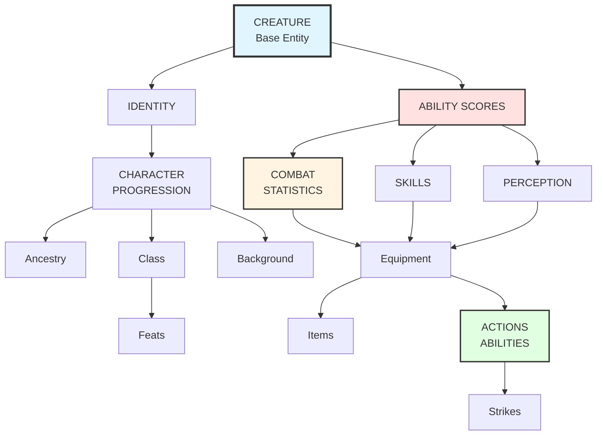
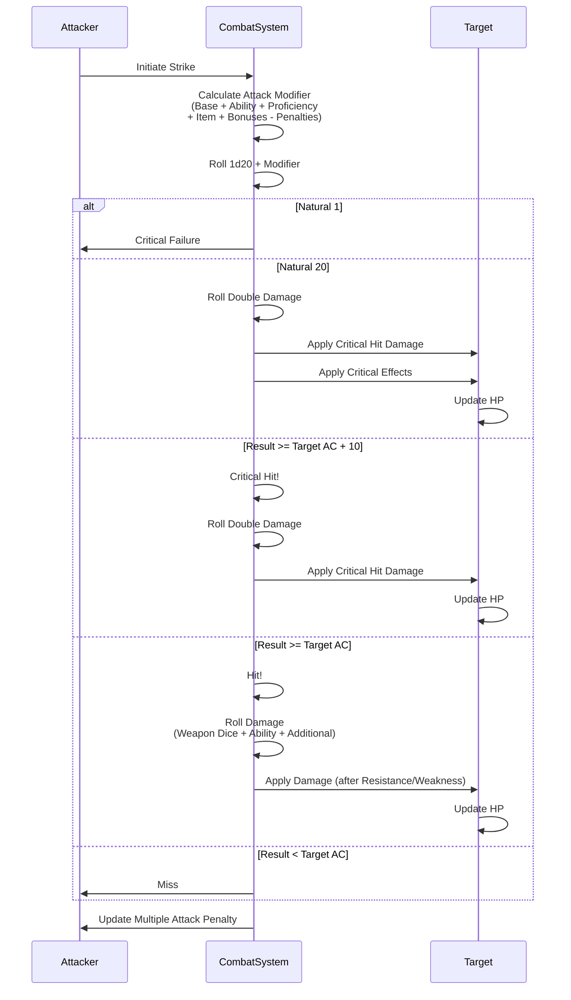
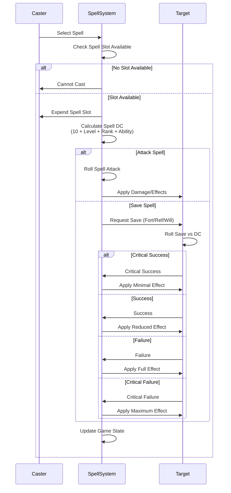
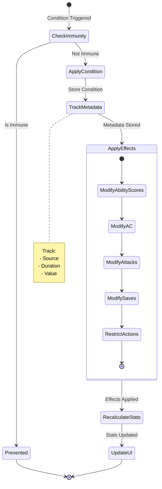

# Creature System Relationships and Dependencies

## Overview

This document illustrates how the different components of the creature representation system relate to and depend on each other, providing a comprehensive view of the system architecture.

## Component Dependency Graph



## Core Dependencies

### Ability Scores → Everything

Ability scores are the foundation, affecting:

```
Ability Scores
├→ Combat Statistics
│  ├→ AC (DEX)
│  ├→ HP (CON)
│  ├→ Fort Save (CON)
│  ├→ Ref Save (DEX)
│  └→ Will Save (WIS)
│
├→ Skills (all)
│  ├→ Athletics (STR)
│  ├→ Acrobatics (DEX)
│  ├→ Perception (WIS)
│  └→ ... (etc)
│
├→ Attacks
│  ├→ Melee (STR or DEX)
│  ├→ Ranged (DEX)
│  └→ Spell (INT/WIS/CHA)
│
└→ Class Features
   ├→ Key Ability
   ├→ Class DC
   └→ Spell DC
```

### Proficiencies → Derived Statistics

Proficiency system affects multiple areas:

```
Proficiency Level
├→ Skills (+Level + Rank Bonus)
├→ Saves (+Level + Rank Bonus)
├→ Attacks (+Level + Rank Bonus)
├→ AC (+Level + Rank Bonus)
├→ Spell DC (10 + Level + Rank Bonus + Ability)
└→ Class DC (10 + Level + Rank Bonus + Key Ability)
```

### Level → Multiple Systems

Character/Creature level affects:

```
Level
├→ Proficiency Bonuses (Level + Rank)
├→ Hit Points (Class HP × Level + CON × Level)
├→ Ability Boosts (Every 5 levels)
├→ Class Features (Progression table)
├→ Feat Selection (Level requirements)
└→ Spell Slots (Per level)
```

## Data Flow Diagrams

### Attack Resolution Flow



### Spell Casting Flow



### Condition Application Flow



## Calculation Order

When updating a creature's statistics, follow this order:

### 1. Base Values
```
1. Ability Scores (base)
2. Level
3. Ancestry bonuses
4. Class bonuses
```

### 2. Permanent Modifiers
```
5. Equipment (worn armor, weapons)
6. Feats and Features
7. Proficiency bonuses
8. Ability modifiers
```

### 3. Temporary Modifiers
```
9. Active spell effects
10. Conditions
11. Item bonuses (highest)
12. Status bonuses (highest)
13. Circumstance bonuses (highest)
14. Penalties (all stack)
```

### 4. Derived Values
```
15. AC = 10 + DEX + Proficiency + Item + Bonuses - Penalties
16. HP = Ancestry + (Class + CON) × Level + Bonuses
17. Saves = Ability + Proficiency + Bonuses - Penalties
18. Attacks = Ability + Proficiency + Item + Bonuses - Penalties - MAP
19. Skills = Ability + Proficiency + Item + Bonuses - Penalties
20. Perception = WIS + Proficiency + Bonuses - Penalties
```

## Component Interactions

### Skills ↔ Actions

```
Skills provide modifiers for skill actions:
- Athletics → Climb, Grapple, Jump
- Stealth → Hide, Sneak
- Acrobatics → Balance, Tumble Through

Actions use skill modifiers:
Roll = 1d20 + Skill Modifier

Results trigger effects:
- Success → Achieve goal
- Failure → Penalty or no effect
- Critical → Enhanced or worsened outcome
```

### Equipment ↔ Statistics

```
Equipment modifies statistics:

Armor:
- Increases AC
- Caps DEX modifier
- May reduce speed
- May impose check penalty

Weapons:
- Enable Strikes
- Determine damage
- Grant traits
- May have magic bonuses

Items:
- Grant abilities
- Provide bonuses
- May have activation costs
```

### Class ↔ Progression

```
Class determines:
- Initial proficiencies
- HP per level
- Key ability
- Available feats

Per level, class grants:
- Class features
- Proficiency increases
- Feat selections
- Spell slots (if caster)
```

### Spellcasting ↔ Class/Tradition

```
Tradition determines:
- Available spells
- Spell list
- Focus spells

Class determines:
- Spellcasting ability
- Spell slots
- Prepared vs spontaneous
- Spellcasting proficiency

Together they set:
- Spell DC = 10 + Level + Rank + Ability
- Spell Attack = Level + Rank + Ability
```

## System Boundaries

### What the System Handles

✅ **Creature Statistics**
- All numeric values
- Proficiency tracking
- Modifier calculations

✅ **Actions and Abilities**
- Action definitions
- Effect application
- Targeting rules

✅ **Equipment Management**
- Item properties
- Bonus application
- Usage tracking

✅ **Condition Tracking**
- Active conditions
- Duration management
- Effect application

✅ **Progression**
- Level advancement
- Feat selection
- Proficiency increases

### What the System References

🔗 **Rule Implementations**
- Combat rules
- Spell effects
- Skill check DCs

🔗 **Content Libraries**
- Spell definitions
- Item catalog
- Feat database
- Class features

🔗 **Game State**
- Turn order
- Round count
- Position/map

## Extension Points

The system provides hooks for extending functionality:

### Custom Abilities

```typescript
interface CustomAbility {
  // Standard ability structure
  ...standardFields,
  
  // Custom implementation
  customEffect: (context: GameContext) => Effect[],
  
  // Validation
  canUse: (creature: Creature, context: GameContext) => boolean
}
```

### Custom Conditions

```typescript
interface CustomCondition {
  // Standard condition structure
  ...standardFields,
  
  // Custom behavior
  onApply: (creature: Creature) => void,
  onRemove: (creature: Creature) => void,
  onTurn: (creature: Creature, phase: "start" | "end") => void
}
```

### Custom Rules

```typescript
interface CustomRule {
  id: string,
  trigger: GameEvent,
  condition: (context: GameContext) => boolean,
  effect: (context: GameContext) => void
}
```

## Performance Considerations

### Caching Strategy

```
High-Frequency Calculations (cache):
- AC
- Save modifiers
- Attack modifiers
- Skill modifiers

Invalidate Cache When:
- Ability scores change
- Equipment changes
- Conditions added/removed
- Proficiency changes
```

### Lazy Evaluation

```
Calculate On Demand:
- Spell DCs (when casting)
- Damage rolls (when hitting)
- Skill checks (when rolling)

Don't Pre-Calculate:
- All possible attack combinations
- All skill check results
- Hypothetical outcomes
```

### Batch Operations

```
Group Related Updates:
1. Apply all condition effects
2. Recalculate affected statistics once
3. Update UI once

Don't:
- Recalculate after each modifier
- Update UI after each change
- Validate between related changes
```

## Validation Points

The system validates data at key points:

### Creation Time
- All required fields present
- Values within valid ranges
- References exist
- Prerequisites met

### Runtime
- Actions are legal
- Resources available
- Targets valid
- Effects applicable

### Update Time
- Changes maintain consistency
- Dependencies updated
- Derived values recalculated
- State remains valid

## Related Documents

This document ties together concepts from:

- [Creature Representation Overview](creature-representation-overview.md)
- [Core Attributes](core-attributes.md)
- [Combat Statistics](combat-statistics.md)
- [Actions and Abilities](actions-and-abilities.md)
- [Skills and Proficiencies](skills-and-proficiencies.md)
- [Conditions and Effects](conditions-and-effects.md)
- [Extensibility Guide](extensibility-guide.md)
- [Data Structures](data-structures.md)
- [Examples](examples.md)
