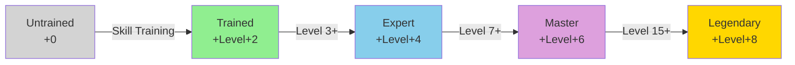
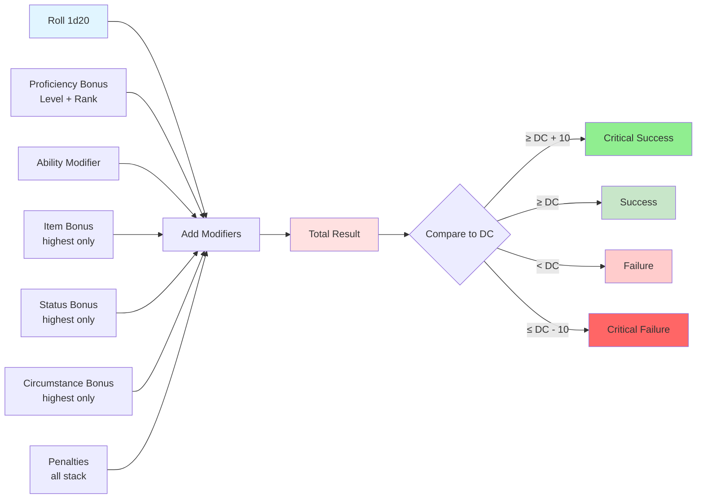

# Skills and Proficiencies

## Overview

Skills represent a creature's training in specific areas of expertise. The Pathfinder 2e proficiency system provides a unified way to track training levels across skills, weapons, armor, and other abilities.

## Proficiency System



### Proficiency Ranks

All proficiencies in Pathfinder 2e use the same five-rank system:

| Rank | Bonus | Description |
|------|-------|-------------|
| **Untrained** | +0 | No training |
| **Trained** | +Level + 2 | Basic training |
| **Expert** | +Level + 4 | Significant expertise |
| **Master** | +Level + 6 | Masterful skill |
| **Legendary** | +Level + 8 | Legendary prowess |

### Proficiency Calculation

```
Proficiency Bonus = Level + Rank Bonus
```

For example, a 5th-level character with Expert proficiency:
```
Proficiency Bonus = 5 + 4 = +9
```

## Skills

Pathfinder 2e has the following skills, each tied to a specific ability score.

### Strength Skills

**Athletics (STR)**
- Climb, Force Open, Grapple, High Jump, Long Jump, Shove, Swim, Trip, Disarm

### Dexterity Skills

**Acrobatics (DEX)**
- Balance, Maneuver in Flight, Squeeze, Tumble Through

**Stealth (DEX)**
- Conceal an Object, Hide, Sneak

**Thievery (DEX)**
- Palm an Object, Steal, Disable a Device, Pick a Lock

### Constitution Skills

None (Constitution primarily affects Hit Points and Fortitude saves)

### Intelligence Skills

**Arcana (INT)**
- Recall Knowledge (arcane matters), Decipher Writing, Identify Magic, Learn a Spell

**Crafting (INT)**
- Craft, Earn Income, Identify Alchemy, Repair

**Occultism (INT)**
- Recall Knowledge (occult matters), Decipher Writing, Identify Magic, Learn a Spell

**Society (INT)**
- Recall Knowledge (civilization, culture, history, local traditions), Subsist, Decipher Writing

**Lore (INT)** - Various specific lore skills
- Recall Knowledge about specific topics (e.g., Absalom Lore, Dragon Lore, Sailing Lore)

### Wisdom Skills

**Medicine (WIS)**
- Administer First Aid, Treat Disease, Treat Poison, Treat Wounds

**Nature (WIS)**
- Recall Knowledge (natural world), Command an Animal, Identify Magic, Learn a Spell

**Religion (WIS)**
- Recall Knowledge (divine matters, undead), Decipher Writing, Identify Magic, Learn a Spell

**Survival (WIS)**
- Sense Direction, Subsist, Track, Cover Tracks

### Charisma Skills

**Deception (CHA)**
- Create a Diversion, Feint, Lie, Impersonate

**Diplomacy (CHA)**
- Gather Information, Make an Impression, Request

**Intimidation (CHA)**
- Coerce, Demoralize

**Performance (CHA)**
- Perform, Earn Income

## Skill Check Structure



### Basic Skill Check
```
Skill Check = 1d20 + Proficiency Bonus + Ability Modifier + Other Bonuses/Penalties
```

**Components:**
- **Proficiency Bonus**: Based on training level
- **Ability Modifier**: From associated ability score
- **Item Bonus**: From tools or magical items
- **Status Bonus**: From spells or conditions
- **Circumstance Bonus**: From situation or tactics
- **Penalties**: Various sources

### Critical Success and Failure

- **Critical Success**: Beat DC by 10 or more, or roll natural 20 and succeed
- **Critical Failure**: Miss DC by 10 or more, or roll natural 1 and fail

Many skill actions have special effects on critical success or failure.

## Data Structure

### Skills Object

```typescript
interface Skills {
  // Core skills
  acrobatics: Skill;
  arcana: Skill;
  athletics: Skill;
  crafting: Skill;
  deception: Skill;
  diplomacy: Skill;
  intimidation: Skill;
  medicine: Skill;
  nature: Skill;
  occultism: Skill;
  performance: Skill;
  religion: Skill;
  society: Skill;
  stealth: Skill;
  survival: Skill;
  thievery: Skill;
  
  // Lore skills (variable)
  lore: {
    [loreName: string]: Skill;
  };
}

interface Skill {
  // Core Values
  total: number;               // Calculated total modifier
  abilityModifier: number;     // From associated ability
  proficiency: ProficiencyLevel;
  proficiencyBonus: number;    // Level + rank bonus
  
  // Additional Modifiers
  itemBonus: number;
  statusBonus: number;
  circumstanceBonus: number;
  penalties: number;
  
  // Training
  trained: boolean;            // Quick check if trained
  
  // Special Modifiers
  armorCheckPenalty: boolean;  // If this skill takes ACP
  
  // Notes
  specializations: string[];   // Specific focuses (e.g., "Legal Lore")
  notes: string;
}
```

## Skill Actions

### Common to All Skills

**Recall Knowledge** ◆
- **Action**: 1 action
- **Requirements**: Varies by skill
- **Description**: Attempt to remember information about the subject
- **Critical Success**: Recall accurate information and an additional fact
- **Success**: Recall accurate information
- **Critical Failure**: Recall incorrect information

### Skill-Specific Actions

#### Athletics

**Climb** ◆
- **Requirements**: Both hands free
- **Success**: Move up to 1/4 your Speed (round down to nearest 5 feet)
- **Critical Failure**: Fall and land prone

**Grapple** ◆
- **Requirements**: One hand free, target within reach
- **Success**: Target is grabbed
- **Critical Success**: Target is restrained until end of your next turn

**Shove** ◆
- **Requirements**: One hand free, target within reach
- **Success**: Push target 5 feet away
- **Critical Success**: Push target 10 feet away and can Stride after it

**Trip** ◆
- **Requirements**: One hand free or using trip weapon, target within reach
- **Success**: Target falls prone
- **Critical Failure**: You fall prone

#### Stealth

**Hide** ◆
- **Requirements**: Cover or concealment
- **Success**: Undetected by creatures you're hidden from
- **Critical Success**: +2 circumstance bonus to initiative

**Sneak** ◆
- **Requirements**: Hidden or undetected
- **Success**: Move up to half your Speed while remaining undetected
- **Failure**: Still hidden, but no longer undetected

#### Thievery

**Disable a Device** ◆◆
- **Requirements**: Thieves' tools
- **Success**: Disable device
- **Critical Success**: Disable device and avoid triggering it
- **Critical Failure**: Trigger device

**Pick a Lock** ◆◆
- **Requirements**: Thieves' tools
- **Success**: Unlock lock
- **Critical Success**: Unlock in half the time
- **Critical Failure**: Break thieves' tools

#### Medicine

**Treat Wounds** ◆ (10 minutes)
- **Requirements**: Healer's tools
- **Success**: Restore 2d8 HP (or more with higher proficiency)
- **Critical Success**: Add level to HP restored
- **Critical Failure**: Deal 1d8 damage

**Administer First Aid** ◆◆
- **Requirements**: Healer's tools or hands (with Battle Medicine feat)
- **Success**: Stabilize dying creature or grant temporary HP
- **Critical Success**: Grant additional temporary HP

## Skill Increases

### Gaining Skill Training

Characters gain skill increases through:

1. **Character Creation**:
   - Background: 2 skill trainings
   - Class: Variable number of trainings
   - Intelligence modifier: Additional trainings equal to INT modifier

2. **Level Advancement**:
   - Gain skill increases at specific levels (typically every even level)
   - Can increase from Untrained → Trained or improve existing proficiency

3. **Feats**:
   - Skill Training feat: Gain training in any skill
   - Various feats grant proficiency increases

### Skill Increase Rules

- Can only increase a skill to Trained if currently Untrained
- Can only increase beyond Trained if level requirement met:
  - Expert: Level 3+
  - Master: Level 7+
  - Legendary: Level 15+

## Armor Check Penalty

Some skills suffer penalties from wearing armor:

**Affected Skills:**
- Acrobatics
- Athletics
- Stealth
- Thievery

**Penalty Values:**
- Light Armor: 0 or -1
- Medium Armor: -2 or -3
- Heavy Armor: -3 or -4

**Exception:** If Strength meets or exceeds armor's requirement, reduce penalty by 5 (minimum 0)

## Lore Skills

Lore represents specialized knowledge in a specific area.

### Common Lore Skills
- Academia Lore
- Alcohol Lore
- Architecture Lore
- Circus Lore
- Dragon Lore
- Genealogy Lore
- Guild Lore
- Herbalism Lore
- Legal Lore
- Mercantile Lore
- Sailing Lore
- Scribing Lore
- Theater Lore
- Underworld Lore
- Warfare Lore

### Creating Lore Skills

Lores should be:
- Narrow in scope (more specific than regular skills)
- Focused on a specific topic, location, or organization
- Useful but not overshadowing regular skills

**Data Structure:**
```typescript
interface LoreSkill extends Skill {
  category: "general" | "specific" | "regional" | "organization";
  description: string;
  relatedSkills: string[];  // Which skills it might overlap with
}
```

## Skill Feats

Many feats enhance or provide new uses for skills.

### Skill Feat Categories

**General Skill Feats:**
- Available to anyone
- Requirements often include proficiency level
- Examples: Assurance, Cat Fall, Experienced Professional

**Skill-Specific Feats:**
- Tied to specific skills
- Often require Expert or higher proficiency
- Examples: Battle Medicine, Cloud Jump, Quick Climb

### Skill Feat Structure

```typescript
interface SkillFeat extends Feat {
  type: "skill";
  
  prerequisites: {
    skills: {
      skill: string;
      minimumProficiency: ProficiencyLevel;
    }[];
  };
  
  benefits: {
    newActions?: string[];
    modifyActions?: {
      action: string;
      changes: string;
    }[];
    passiveBenefits?: string;
  };
}
```

## Skill Challenges

Extended skill challenges use multiple checks:

### Format
1. **Setup**: Define goal and required successes
2. **Progression**: Track successes and failures
3. **Resolution**: Achieve goal or suffer consequences

### Example: Research Challenge
```
Goal: Research ancient artifact
Required: 5 successes before 3 failures
Skills: Arcana, Occultism, Society
DC: 20
Time: 1 day per check
```

## Common Skill DCs

| Task Difficulty | DC | Example |
|----------------|-----|---------|
| **Untrained** | 10 | Climb a knotted rope |
| **Trained** | 15 | Climb a typical tree |
| **Expert** | 20 | Climb a rough cave wall |
| **Master** | 30 | Climb a smooth wall |
| **Legendary** | 40 | Climb a perfectly smooth wall |

### Adjustments

**Easy (+2 to +5 lower DC):**
- Favorable circumstances
- Proper tools
- Preparation time

**Hard (+2 to +5 higher DC):**
- Unfavorable circumstances
- Lacking proper tools
- Time pressure

## Group Checks

When multiple characters attempt the same task:

### Types

**Collaborative Check:**
- One character leads (makes the check)
- Others assist (Aid action, DC = 20)
- Each success grants +1 circumstance bonus

**Individual Checks:**
- Everyone makes their own check
- Judge results individually

**Group Check:**
- Everyone rolls
- If majority succeed, group succeeds
- Otherwise, group fails

## Tools and Equipment

Many skills benefit from or require tools:

| Skill | Tool | Cost | Bulk |
|-------|------|------|------|
| Medicine | Healer's Tools | 5 gp | 1 |
| Thievery | Thieves' Tools | 3 gp | L |
| Crafting | Artisan's Tools | Varies | 2 |
| Performance | Musical Instrument | Varies | Varies |

**Tool Benefits:**
- Required for certain actions
- May provide item bonus with superior versions
- Prevent improvised penalties

## Skill Synergies

Some skills work together:

**Knowledge Skills (Arcana, Nature, Occultism, Religion):**
- Can Recall Knowledge in their domains
- Can Identify Magic of their tradition
- Can Learn Spells of their tradition

**Social Skills (Deception, Diplomacy, Intimidation):**
- Different approaches to influence
- May combo in complex social encounters

**Physical Skills (Acrobatics, Athletics):**
- Often used in sequence during chases
- Complementary in combat maneuvers

## Complete Proficiencies Structure

```typescript
interface Proficiencies {
  // Skills
  skills: Skills;
  perception: ProficiencyLevel;
  
  // Combat
  weapons: {
    category: {
      simple: ProficiencyLevel;
      martial: ProficiencyLevel;
      advanced: ProficiencyLevel;
      unarmed: ProficiencyLevel;
    };
    specific: {
      [weaponName: string]: ProficiencyLevel;
    };
  };
  
  armor: {
    unarmored: ProficiencyLevel;
    light: ProficiencyLevel;
    medium: ProficiencyLevel;
    heavy: ProficiencyLevel;
  };
  
  // Saves
  saves: {
    fortitude: ProficiencyLevel;
    reflex: ProficiencyLevel;
    will: ProficiencyLevel;
  };
  
  // Class Features
  classDC: ProficiencyLevel;
  spellAttack: ProficiencyLevel;
  spellDC: ProficiencyLevel;
}
```

## Related Documents

- [Core Attributes](core-attributes.md) - Ability modifiers for skills
- [Combat Statistics](combat-statistics.md) - How proficiencies affect combat
- [Actions and Abilities](actions-and-abilities.md) - Skill actions in detail
- [Classes and Progression](classes-and-progression.md) - Gaining skill proficiencies
- [Feats and Features](feats-and-features.md) - Skill feats
